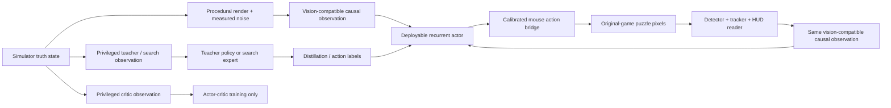

# Reinforcement-Learning Training and Sim-to-Game Transfer Roadmap

## Document status

Last reviewed: 2026-07-22.

This is the implementation plan for building an RL system that learns primarily
in the headless clone and can actually control an authorized local copy of
IriSu Syndrome v2.03 normal mode.

This document is deliberately stricter than “make PPO run.” A simulator score is
useful research evidence, but it is not the project outcome. The outcome is a
causal, pixel-driven agent that uses only legal mouse input, runs at normal game
speed, and retains its skill in the original executable under a locked,
human-comparable evaluation protocol.

The mechanics contract remains in [`clone.md`](clone.md), the current fidelity
status in [`docs/fidelity.md`](docs/fidelity.md), and the overall project goal in
[`plan.md`](plan.md). If this document conflicts with a newly measured
original-game fact, the measurement wins and this document must be updated.

## Executive summary

The simulator core is far enough along to begin RL engineering now. The
repository already has deterministic reset/step behavior, exact score-delta
reward, termination/truncation separation, snapshots and state hashes, portable
and exact backends, typed 196-body observations, vector execution, random and
scripted policies, transfer-noise wrappers, and exact-worker rollout support.

What does not yet exist is the complete learning and transfer system:

1. A stable numeric observation encoder and conditional hybrid-action adapter.
2. A reproducible neural training stack and vector rollout manager.
3. Curriculum artifacts, recurrent PPO, evaluation tooling, and model
   checkpoints.
4. A conservative observation contract that a real vision system can reproduce.
5. A real-game detector, tracker, HUD reader, coordinate calibrator, and
   timestamped input bridge.
6. Teacher-to-student distillation and sim-to-real data iteration.
7. The remaining original-game fidelity gates: five-category controlled
   scenarios, spawn/difficulty distribution validation, and scripted-policy
   transfer.
8. A locked expert-human comparison and final statistical evaluation.

The central transfer rule is:

> The deployed actor may consume only information that can be computed causally
> from puzzle-region pixels, timestamps, and its own prior actions. Privileged
> simulator state may train a teacher or critic, but it must never become a
> required deployment input.

The recommended first learning algorithm is recurrent PPO with a masked,
conditional action distribution. SAC is a later experiment, not the first
integration target, because the mixed discrete/continuous/semi-Markov action
space makes a correct off-policy implementation substantially more involved.

The permanent full-game reward is exactly:

```text
raw_reward_t = score_after - score_before
```

No permanent survival bonus, match bonus, click penalty, ejection penalty, or
hand-authored “good play” score should be added. Curriculum-only shaping must be
explicit, potential-based where practical, recorded in metadata, and reduced to
zero before final full-game optimization.

## 1. Non-negotiable invariants

These invariants apply to every trainer, wrapper, model, dataset, and evaluation
script.

### 1.1 Target and evidence boundary

- Target only v2.03 normal mode unless a separate project explicitly selects
  another version or mode.
- Do not mix v1.x, Metsu, EX, glitch-assisted, or unknown-version results into
  the v2.03 normal training or evaluation distribution.
- Use the exact worker when replay-exact behavior matters. The portable backend
  is useful for API development and diagnostics but is not long-horizon
  trajectory-identical.
- Keep original binaries, art, music, personal replays, and raw authorized
  captures outside version control unless their licenses explicitly allow
  inclusion.
- Every promoted original-game measurement must retain hashes, environment
  metadata, units, uncertainty, and a reproducible action trace.

### 1.2 Causality and information

- Never expose game RNG state, future spawns, snapshot bytes, native contact
  caches, allocator state, state hashes, hidden finish metadata, or process
  memory to a policy.
- Do not let the deployed actor consume exact body IDs, exact hidden timers, or
  exact chain membership merely because the clone can report them.
- A recurrent policy may infer hidden state from prior observations and actions.
  That is causal and desirable.
- The trainer may use privileged information for a teacher, search procedure, or
  value critic only when the actor input is kept separately auditable.
- Evaluation must begin from a clean recurrent state. No hidden state may carry
  across games.

### 1.3 Actions

- The final agent acts only through legal cursor coordinates and weak/strong
  clicks under a fixed, human-comparable input-rate rule.
- Fast-forward is excluded unless it is explicitly included for humans and the
  agent in the final protocol.
- The simulator must continue to accept raw legal actions even if the learner
  also uses candidate actions or body-relative proposals.
- Invalid actions are bugs or masked choices, not a source of useful reward.
- Actual input timing, button press/release semantics, cursor quantization, and
  latency must be measured and reproduced in training.

### 1.4 Objective and evaluation

- The canonical environment reward remains exact score delta.
- Training-time reward transformations must never overwrite the logged raw
  reward.
- Final model selection is based on held-out raw score and reliability, not
  shaped return or training loss.
- Training, validation, calibration, and final evaluation data must be disjoint
  and immutable after locking.
- Evaluation seeds/runs may not be rejected, retried, or selected after seeing
  the outcome.
- A single exceptional score is not evidence of superhuman performance.

### 1.5 Reproducibility

- Every run records source identity, dirty-tree identity, mechanics config hash,
  worker and exact-host hashes, dependency lock identity, encoder/action schema
  versions, all seeds, and all hyperparameters.
- Checkpoints include optimizer, scheduler, normalization, recurrent, RNG, seed
  allocator, and curriculum state—not only model weights.
- Reported policies must be replayable from an immutable checkpoint and
  metadata manifest.
- Diagnostic hashes and event traces may be logged for audits but must not enter
  policy tensors.

## 2. Current state: what is already done and what remains

### 2.1 Implemented foundation

| Area | Current capability |
|---|---|
| Core mechanics | End-to-end v2.03 normal-mode clone with recovered RNG, spawning, lifecycle, scoring, gauge, level progression, and terminal ordering |
| Physics | Portable GNU backend plus opt-in exact MSVC9/Box2D worker |
| API | Gymnasium-shaped `IrisuEnv` with reset, step, render, clone/restore, and state hash |
| Reward | Exact integer score delta |
| Episodes | Real game-over termination and separate training truncation |
| Observations | Public scalar/body state and fixed 196-slot typed padded form |
| Actions | Wait, weak, strong, and raw simultaneous-button state |
| Determinism | Same-seed/action equivalence, canonical hashes, transactional restore tests |
| Planning support | Durable exact snapshots and Linux-local fork/COW branches |
| Parallelism | Sync, threaded, padded, exact worker-backed vector execution |
| Baselines | Seeded `RandomPolicy` and legacy exact-schema `MatcherShotPolicy` |
| Robustness | Seeded action delay, observation delay, cursor error, position/velocity noise, dropped detections, and merged detections |
| Throughput | Exact packed vector throughput has been measured and explicitly accepted for RL despite remaining below the old numeric target |

The recorded dependency-free/standard native and Python suites pass against the
current `build/` artifact, and the existing exact Release and sanitizer suites
also pass. The Gymnasium-enabled configuration is not fully green: the two
cross-backend type/equality failures described below remain open. These results
establish a strong engineering base; they do not close the RL integration or
original-game transfer gates.

### 2.2 Formal blockers before bulk training

The following are still release blockers for large training runs intended to
support transfer claims:

1. **Five-category controlled golden corpus.** Populate admissible original-game
   scenarios for match, rot, chain, ejection, and orb behavior. Each category
   and the overall set must meet the 95% gate, with exact score/gauge/level
   transitions and bounded 0.5–1.0 second trajectories.
2. **Spawn/difficulty distribution study.** Produce a separate hashed
   statistical comparison across relevant phases, with sample counts,
   confidence intervals, and a predeclared test or distance metric.
3. **Scripted-policy transfer.** Run the explicitly defined
   `vision-matcher-v1` port of the legacy `MatcherShotPolicy` heuristic through
   the same causal perception/scheduler/click-macro path in the clone and
   original game, and demonstrate the same basic qualitative skill in both.
   When this gate passes, update [`docs/fidelity.md`](docs/fidelity.md) to name
   the compatibility policy and evidence artifact rather than implying the
   legacy exact-dictionary class ran on pixels.
4. **Complete admissible evidence bundle.** Preserve the original-game frames,
   actions, replay, measurements, hashes, environment, and notes required by the
   golden scorer and reference protocol.

Replay parity is important but does not replace these gates: a learned policy
will visit states and take actions that the four replay traces did not cover.

### 2.3 Known RL integration gaps

These gaps should be treated as work items rather than left for the training
script to improvise:

- The ordinary Gym observation is a variable `Sequence(Dict)` with text
  categories and unbounded boxes. Most standard policy implementations need a
  fixed numeric tensor and mask.
- The fast padded API returns reusable `ctypes` views, not immutable framework
  tensors. The adapter must consume or copy them before the next lane update.
- Observation types currently depend on whether Gymnasium is importable:
  `IrisuEnv` converts fields to NumPy scalars while `PaddedVectorEnv` retains
  typed fields. A Gym-enabled audit exposes two cross-backend equivalence
  failures. Normalize this boundary before locking the training dependency set.
- The current action space exposes four kinds, including `BOTH_SHOTS`, and
  unconditional coordinates/wait duration. The learned policy needs a
  conditional distribution over only meaningful branch parameters.
- Actions are button levels, not abstract clicks. Repeated held levels do not
  create repeated shots. The RL action macro must explicitly model rising
  edges and release.
- `PaddedVectorEnv` requires manual lane reset, has no standard final-observation
  convention, and resolves unspecified lane seeds to zero. A trainer must own
  unique seed scheduling and terminal bookkeeping.
- Padded vector configuration is fixed at construction. Efficient per-episode
  mechanics randomization needs lane recreation or a vector factory.
- `TransferRobustnessEnv` owns three RNG streams and delayed-observation history
  but has no clone/restore operation. Native snapshots alone are insufficient
  for branch-exact planning with transfer noise.
- Physics-owned and scripted public velocities use different units. The numeric
  encoder must convert them to one convention and test known examples.
- The exact actor rollout pool runs lane-local policies concurrently. It is not
  a centralized batched neural-inference interface.
- No trainer, tensor model, optimizer, experiment manager, checkpoint format, or
  RL dependency group is currently checked in.
- [`benchmarks/results/provisional-training-readiness-2026-07-20.json`](benchmarks/results/provisional-training-readiness-2026-07-20.json)
  still records `accepted_for_bulk_training: false` and
  `provisional-not-ready`. Automation must preserve that historical result
  while separately recording any later owner acceptance and its evidence; it
  must not treat this provisional artifact as a current bulk-training permit or
  silently rewrite its gate.
- Stale build directories can contain older mechanics defaults. Training must
  use a clean, explicitly hashed library/worker rather than whichever build
  directory happens to resolve first.

## 3. End-to-end system architecture

The project needs three distinct runtime paths and four distinct information
contracts.



### 3.1 Information contracts

1. **Simulator truth state:** all state required to advance the clone, including
   hidden RNG and physics internals. This is never a policy observation.
2. **Privileged training observation:** exact current object and rule fields
   useful to a teacher, search expert, or critic. It must be clearly marked and
   cannot define the deployed actor’s required input.
3. **Vision-compatible causal observation:** only quantities obtainable from
   current/prior frames, timestamps, and prior actions, including uncertainty.
   Its simulator producer is a render-phase visibility oracle, not a direct copy
   of the object table. This is the primary student actor contract.
4. **Raw pixels:** cropped original-game or procedurally rendered frames used by
   perception. Direct pixel-to-action RL is a fallback rather than the initial
   design.

### 3.2 Recommended policy hierarchy

- **Search/script expert:** optional privileged exact-state policy used to
  generate strong candidate actions and labels.
- **Primary actor:** recurrent policy over vision-compatible object tracks.
- **Privileged critic:** exact-state value estimator used only while training in
  simulation. It may improve sample efficiency without contaminating actor
  inputs.
- **Deployment bundle:** perception model, tracker, actor, preprocessing
  constants, coordinate calibration, input limiter, and recurrent state.

The actor and critic encoders must be separate modules with separately declared
schemas. It must be impossible to add a critic-only tensor to the actor by
accident.

## 4. Formal environment and objective

### 4.1 Time model

The game advances in fixed 0.020-second gameplay ticks, or 50 ticks per second.
The learner should operate as a semi-Markov decision process (SMDP): one policy
decision may advance one or more game ticks.

For transition `t`:

- `o_t` is the observation at a policy decision boundary.
- `a_t` is wait or a weak/strong fire macro.
- `k_t` is the exact number of gameplay ticks advanced by the macro.
- `r_t` is the sum of score deltas across those `k_t` ticks.
- `o_(t+1)` is the observation at the next decision boundary.

The rollout buffer must store `k_t`. Treating every decision as equal duration
would distort discounting, GAE, entropy per unit time, throughput reporting, and
latency evaluation. In training, exact `k_t` comes only from simulator
transition bookkeeping. Executor timestamps cannot establish how many hidden
original-game updates occurred and must never be substituted into SMDP targets
as an exact count. The original-game runner instead records wall duration and a
tick-count/phase posterior with uncertainty. The actor receives only causal
wall-time/frame features—requested action duration, monotonic elapsed time,
completed-frame sequence, frame age, estimated presentation cadence, and
confidence. Simulator training must generate those features through the
measured presentation/capture model rather than copying the exact native tick
delta into the actor tensor.

### 4.2 Episode boundary

- **Terminated:** the original game-over condition occurred. The value bootstrap
  is zero.
- **Truncated:** a training time/horizon/resource limit ended the sample without
  game over. Bootstrap from the final observation.
- **Replay exhausted:** a fidelity-evaluation condition, not the normal RL
  terminal rule.
- **Training transport failure:** infrastructure failure. Discard or explicitly
  mark the affected fragment; never reinterpret it as game over.
- **Post-start deployment failure:** capture, perception, inference, watchdog,
  or input failure after a final-evaluation game has begun. This is an agent
  outcome and must be scored under the preregistered failure rule; it is not a
  free rerun.

The vector adapter must retain the real terminal observation before resetting a
lane.

### 4.3 True optimization target

The desired episodic objective is expected final raw score:

```text
J(pi) = E_pi[score_at_game_over - score_at_reset]
      = E_pi[sum_t (score_(t+1) - score_t)]
```

The current normal reset score is zero, but keeping the subtraction explicit
prevents curriculum/nonstandard reset states from changing the objective.

Use undiscounted episodic return (`gamma_tick = 1`) as the default because it
matches final-score evaluation. If a non-unit discount is tested, it must be
defined per gameplay tick and converted for each SMDP transition:

```text
gamma_t = gamma_tick ** k_t
```

A per-decision discount is incorrect when waits have different durations.

Expected score is the default policy objective. Median, lower-quantile, or CVaR
returns are robustness diagnostics unless a different risk functional is
preregistered as the actual objective before training. If a risk-sensitive
objective is selected, use the same aggregation rule for model selection,
future-belief search, and final statistical evaluation; do not switch between
mean and worst-case opportunistically.

## 5. Reward specification

### 5.1 Canonical reward

The environment emits signed 64-bit integer raw score delta:

```text
r_raw_t = score_after - score_before
```

This value is the authoritative environment transition reward. Store it
unmodified in trajectories, episode reports, evaluation records, and replay
audits.

Before freezing the final human benchmark, reconcile four potentially distinct
terminal quantities: summed transition reward, final live score, the score
visibly presented by the original game, and the first/latest score persisted in
replay/result metadata. The original can continue the terminal gameplay update
after its first finish call. If those quantities differ, the benchmark must
declare which human-visible/persisted result is authoritative and the training
objective must be reviewed explicitly rather than silently comparing different
scores.

### 5.2 Optimizer-facing scaling

Sparse, differently sized score events can make value optimization awkward.
The trainer may use:

```text
r_opt_t = r_raw_t / reward_scale
```

Requirements:

- Use a fixed, versioned scale for the main experiment family.
- Do not clip score deltas; clipping destroys the value of larger chains.
- If running return normalization is tested, checkpoint its statistics and
  continue logging unnormalized returns.
- Never normalize across evaluation episodes when computing reported scores.
- Choose the scale from a frozen exploratory dataset, not from final evaluation
  data.

Start with a simple fixed scale and compare value-loss/advantage statistics
before adding adaptive normalization. The exact numeric scale is a tuning
parameter, not a game mechanic.

### 5.3 SMDP value targets and GAE

The native environment aggregates all score changes that occur inside a
multi-tick wait. With `gamma_tick = 1` this aggregate is exact. If a future
experiment uses `gamma_tick < 1`, an exact discounted SMDP reward also needs the
tick offset of every internal score change:

```text
R_discounted_t = sum_i (
    gamma_tick ** score_event_offset_i
    * score_event_delta_i
)
```

Use a zero-based convention: a score delta produced by the first internal tick
has offset zero.

Do not combine an undiscounted macro reward with `gamma_tick ** k_t` and call it
an exact discounted return. Either keep the default `gamma_tick = 1`, retain
score-event offsets through the rollout path, or clearly label the endpoint
aggregation as an approximation.

Let `terminal_t` mean true game over and `episode_end_t` mean either termination
or truncation. With `R_t` equal to the appropriate optimizer-facing macro
reward:

```text
delta_t = R_t
          + (1 - terminal_t) * (gamma_tick ** k_t) * V(o_(t+1))
          - V(o_t)
```

Generalized advantage estimation must likewise use elapsed-tick discount:

```text
A_t = delta_t
      + (1 - episode_end_t)
        * (gamma_tick * lambda_tick) ** k_t
        * A_(t+1)
```

The truncation delta bootstraps from the retained final observation, but the
advantage recursion stops at that episode boundary so it cannot flow into the
reset observation. With `gamma_tick = 1`, `lambda_tick < 1` can still control
variance. Log advantage magnitude by action duration to detect
duration-dependent bias. As in ordinary GAE, shorter trace decay trades variance
for bias; time-based parameterization does not remove that tradeoff.

The equation deliberately treats `lambda_tick` as a per-20-ms trace decay. It
must be derived from a declared time constant, for example:

```text
lambda_tick = 2 ** (-0.020 / trace_half_life_seconds)
```

Do not copy the common decision-epoch PPO value `lambda=0.95` into
`lambda_tick`; over a long wait it would erase the trace. If the implementation
instead chooses one `lambda_decision` factor per policy decision, use
`(gamma_tick ** k_t) * lambda_decision` in the recursion and version that
different convention explicitly.

### 5.4 Curriculum shaping

The full-game policy must ultimately optimize raw score only. Early skill
curricula may use temporary shaping under one of these contracts:

1. A separately defined finite task whose success reward is part of that
   pretraining task only.
2. Potential-based shaping:

```text
r_shaped_t = r_opt_t
             + alpha(stage, update)
               * ((gamma_tick ** k_t) * Phi(o_(t+1)) - Phi(o_t))
```

The shaping weight `alpha` must be scheduled to zero before final full-game
fine-tuning. Keep it constant for a complete episode/trajectory so the potential
term retains its telescoping property. If a schedule must change within an
episode, define `Psi_t(s)=alpha_t*Phi(s)` and shape with
`gamma^k*Psi_(t+1)(s')-Psi_t(s)` rather than multiplying a transition
difference by a changing coefficient. Every checkpoint records the shaping
implementation and current weight. Define `Phi=0` on true terminal states. Do
not force it to zero on training truncations; those transitions bootstrap from
their retained final observation.

Potential candidates for early curricula include:

| Curriculum | Candidate potential | Required caution |
|---|---|---|
| Single-body strike | Negative distance/velocity error to a target region | Only for that isolated task |
| Ejection | Progress toward a legal side exit with suitable velocity | Do not make side ejection permanently bad or good |
| Pair matching | Geometric/contact progress for the designated pair | Do not reward arbitrary raw match count in full games |
| Rotten clear | Risk-weighted distance from a fresh piece to designated rotten target | Exact rot timer is teacher-only |
| Bonus orb | Progress toward a valid target color | Must not leak hidden future targets |
| Gauge emergency | Bounded gauge/risk potential | Never add a permanent survival reward |

R3b implements the first gauge candidate as a linear normalized potential over
authoritative transition boundaries:

```text
Phi(s) = clamp(gauge(s), 0, gauge_max) / gauge_max
F_t = (gamma_tick ** k_t) * Phi(s_(t+1)) - Phi(s_t)
```

True terminals have `Phi=0`; truncations retain the outgoing potential. The
coefficient is frozen for each complete episode and supplied only to the value
head, allowing curriculum lanes to use different coefficients without giving
that privileged schedule state to the actor. It must reach exact zero before
final score-only fine-tuning. See `docs/rl-reward-shaping.md` for the
implementation, terminal-ordering, transfer, coefficient-selection, and audit
contracts.

Where a potential uses privileged state, it can pretrain a teacher or critic but
must not become a required actor feature.

### 5.5 Rewards and penalties that are prohibited in the permanent task

Do not permanently add:

- reward per elapsed tick or survival time;
- reward per contact, match, clear, or level independent of game score;
- a generic penalty per click;
- a generic penalty for side ejection;
- a bonus for a visually attractive board;
- a game-over penalty in addition to lost future scoring opportunity;
- a reward for matching a scripted heuristic;
- a penalty derived from unavailable hidden state;
- an arbitrary reward clip.

These terms can change the optimal policy, encourage stalling, suppress valid
high-score tactics, or teach behavior that cannot be evaluated fairly.

### 5.6 Invalid actions

The preferred handling is prevention:

- mask structurally invalid branches;
- bound all sampled coordinates;
- make press/release semantics part of the macro;
- validate every encoded action before stepping.

If an invalid action still reaches the simulator, preserve the native
transition reward unchanged, increment an explicit `invalid_action` metric, and
treat any incidence as an adapter defect. Do not assume its reward is zero: an
invalid shot coordinate can still advance a neutral gameplay tick, during which
an unrelated score/rot event may occur. Invalid waits/unknown kinds can follow a
different zero-tick path. Do not conceal either case with a learned penalty.

### 5.7 Reward acceptance tests

Before training:

- For random legal trajectories, assert that summed raw rewards equal final
  score minus reset score.
- Assert equality across scalar, padded, portable, and exact paths for the same
  trace where those paths are expected to agree.
- Assert that one long wait and the equivalent sequence of one-tick waits
  produce equal cumulative raw reward and final state.
- Assert correct bootstrap behavior for termination versus truncation.
- Unit-test the `gamma_tick ** k_t` and GAE implementation.
- Unit-test that shaping telescopes on a fixed trajectory when expected.
- Assert evaluation ignores optimizer scaling and shaping.

## 6. Observation design

### 6.1 Three explicit schemas

Create three versioned schemas:

| Schema | Consumer | Contents |
|---|---|---|
| `truth-v1` | Simulator only | Complete hidden causal state; never serialized into an RL batch |
| `teacher-v1` | Teacher/search/privileged critic | Current public exact object fields plus approved privileged training fields |
| `actor-vision-v1` | Primary and deployed actor | Causal visual estimates, uncertainty, timestamps, and prior-action state |

Every model checkpoint declares exactly one actor schema and, if asymmetric,
one critic schema.

The simulator-side oracle producer for `actor-vision-v1` must apply the measured
render/presentation phase and visibility rules. It excludes fully offscreen or
fully occluded bodies, newborn state not yet presented, truth geometry hidden
behind a merge, exact lifecycle distinctions with identical appearance,
actor-slot order/count, and between-frame truth changes. It emits perfect
render-visible annotations plus causal tracker belief/uncertainty—not perfect
access to all live simulator actors.

### 6.2 Numeric tensor layout

The first encoder should produce:

```text
global_features: float32 [G]
body_features:   float32 [196, F]
body_mask:       bool    [196]
optional_history/recurrent_state
```

Do not pass Python dictionaries, strings, NumPy object arrays, or live `ctypes`
views into the model. Copy or encode padded views before another vector step
reuses their buffers.

### 6.3 Vision-compatible global features

The actor schema should prefer the conservative intersection of what simulation
can produce and vision can recover:

| Feature | Deployment source | Encoding |
|---|---|---|
| Gauge | HUD estimator | Gauge fraction plus confidence |
| Level | HUD OCR/classifier | Bounded/log-scaled value plus confidence |
| Elapsed time | Capture timestamps since reset | Seconds plus timing confidence; not exact native ticks |
| Commanded button state | Input bridge | Requested/injected levels plus acknowledgment uncertainty; not claimed game-polled state |
| Executed cursor | Input bridge/tracker | Current x/y, age, and transform confidence |
| Previous executed action | Input bridge | Kind/coordinates, requested duration, actual down/up/injection timestamps, executed wall duration, and acknowledgment |
| Pending input | Input bridge | Pending kind/age/acknowledgment state |
| Previous action effect | Visual tracker + bridge | Inferred game-poll posterior plus later projectile confirmation/missed/ambiguous state and confidence |
| Recent visual events | Tracker history | Causal births/deaths/merges/clears since the prior decision |
| Capture age/latency | Timestamp pipeline | Seconds and completed-frame intervals |
| Predicted gameplay-effect horizon | Latency/tick-phase estimator | Seconds from observation time to likely game input poll/projectile birth plus uncertainty |
| Detection summary | Tracker | Counts and aggregate confidence |

Score, highest chain, exact qualifying-clear count, and exact spawn interval
should not be actor requirements unless the real pipeline demonstrates reliable
causal recovery. They may be critic inputs and evaluation metrics. Score OCR is
still useful for evaluation and real-data labeling.

### 6.4 Vision-compatible body features

For each active track:

| Feature | Recommended representation |
|---|---|
| Presence | Separate body mask |
| Kind | Class probabilities for piece/projectile/bonus/unknown |
| Shape | Class probabilities for circle/box/triangle/unknown |
| Color | Class probabilities including unknown and bonus |
| Lifecycle | Probabilities for falling/fresh/confirmed/rotten/ambiguous |
| Position | Effect-time predicted normalized x/y, with latest-frame x/y or prediction delta optionally retained |
| Velocity | Common display-units-per-second convention |
| Orientation | Shape-conditional symmetry encoding: circle masked, square `sin(4θ), cos(4θ)`, asymmetric triangle `sin(θ), cos(θ)` |
| Angular velocity | Scaled numeric estimate |
| Size/extent | Normalized width/height or equivalent radius |
| Confidence | Detector and tracker confidence |
| Track age | Time since first observation |
| Missing age | Time since last observation |
| Occlusion/merge | Flags or probabilities |
| Covariance | Optional compact uncertainty for position/velocity |

The deployed schema must not require the simulator’s exact episode-local ID,
chain ID, projectile hit count, rot timer, remaining lifetime, or age counter.
A tracker may provide temporary causal IDs, but the policy must tolerate ID
switches and resets.

Exact held levels in simulation are not an external sensor. In deployment,
button/cursor/pending state comes from the bridge’s own executed-action state and
acknowledgments, with uncertainty after failures. An injection acknowledgment
proves only what the bridge requested/injected; it does not prove the game
sampled that level on a gameplay update.

Name every kinematic feature by its timestamp convention. The initial deployed
schema uses the causal gameplay-effect-time projection for targeting and may
retain the latest-frame measurement/delta for the recurrent model; it must not
mix frame-time position with gameplay-effect-time covariance or silently change
conventions across simulator and real encoders.

If real detection produces more than 196 hypotheses because of false positives,
apply a deterministic, versioned selection rule based on accepted-track status,
confidence, recency, and gameplay relevance; set an overflow health flag. Never
index past capacity or silently make selection depend on detector enumeration
order.

### 6.5 Teacher and critic additions

The teacher/critic may additionally consume:

- exact kind, shape, color, lifecycle, position, angle, and motion;
- stable episode-local body ID;
- chain ID and projectile hit count;
- exact age, remaining lifetime, and rot timer;
- exact gauge, level, score, difficulty, and clear counters;
- current visible held-button levels.

RNG state, future spawns, hidden contact caches, state hash, and snapshot identity
remain prohibited even for the teacher. Planning must not peek at the known
future RNG sequence; it must evaluate uncertainty over future spawns.

### 6.6 Unit conversion and normalization

Public velocity currently has mixed semantics:

- physics-owned bodies report Box2D wrapper world units per second;
- scripted-falling bodies report display displacement per gameplay tick.

Convert to display units per second before model normalization:

```text
if lifecycle == scripted_falling:
    velocity_display_per_second = public_velocity * 50
else:
    velocity_display_per_second = public_velocity * 10
```

Pin this rule with reset-piece and weak/strong projectile tests. Revisit it if a
new body class violates the ownership assumption.

Other rules:

- Normalize x/y against the 640×480 client or measured field geometry, but keep
  one convention across sim and real input.
- Encode angles with fixture symmetry rather than a discontinuous raw scalar:
  circle orientation is masked/undefined; a square uses a quarter-turn-periodic
  representation such as `sin(4 theta), cos(4 theta)`; an asymmetric triangle
  retains its full orientation. Pin the exact mapping to the implemented
  fixtures.
- Use fixed documented scales for velocity, angular velocity, size, level, and
  durations; log out-of-range rates.
- Prefer `log1p` for wide nonnegative teacher timers.
- Use float32 model inputs and explicit boolean masks.
- Never compute normalization statistics from final evaluation data.
- Save any learned/running normalization statistics in the checkpoint.

### 6.7 Set encoder and temporal model

Recommended baseline:

1. Per-body MLP with shared weights.
2. Masked Deep Sets pooling or a small masked self-attention block.
3. Global-feature MLP.
4. Concatenate pooled body/global embeddings.
5. GRU or LSTM over policy decision boundaries.
6. Separate policy and value heads.

Requirements:

- Mask padded slots before every pooling/attention operation.
- Randomly permute body rows during training and assert policy invariance within
  numeric tolerance. Do not let actor-slot order become a hidden feature.
- Reset recurrent state on true episode reset, not on rollout chunk boundaries.
- Store the incoming recurrent state for every rollout sequence.
- Include prior action plus causal elapsed wall time/frame intervals and timing
  confidence so the RNN can interpret irregular decision spacing; keep exact
  native `k_t` in the trainer/critic return path only.
- Benchmark a Deep Sets baseline before a larger set transformer.

An asymmetric actor-critic may give the critic a separate privileged encoder
while the actor sees only `actor-vision-v1`.

### 6.8 Observation acceptance tests

- Same logical observation encodes identically from dictionary, portable padded,
  and exact padded sources.
- Encoding is independent of Gymnasium being installed.
- Encoded tensors own their data and do not change after the next environment
  step.
- Padded garbage beyond `body_count` cannot affect the output.
- Detector overflow follows the declared deterministic policy and sets its
  health flag.
- Body permutation does not materially change the actor distribution or value.
- Known unit conversions match scripted and physics-owned fixtures.
- No prohibited field is present in actor tensors or actor checkpoint metadata.
- Changing an offscreen/fully occluded body, an unpresented newborn, or
  between-captured-frame simulator truth cannot change the actor tensor except
  through allowed elapsed-time prediction.
- Simulated detector corruption produces the same schema as real perception,
  including uncertainty and unknown categories.
- Bridge history distinguishes requested/injected button levels, injection
  acknowledgment, inferred game-poll/effect, and later visual confirmation; an
  acknowledgment alone cannot mark the game effect confirmed.
- A recorded frame sequence produces deterministic tracks and tensors.

## 7. Action design

### 7.1 Deployment action vocabulary

The first deployable policy uses exactly three semantic branches:

```text
WAIT(wait_ticks)
FIRE_WEAK(cursor_x, cursor_y)
FIRE_STRONG(cursor_x, cursor_y)
```

`BOTH_SHOTS` remains available in the low-level simulator for replay fidelity,
but it is excluded from the initial learned action space unless controlled
original-game timing experiments show it is legal, reproducible, and permitted
by the final human-comparable protocol.

### 7.2 Click macro and button edges

The game consumes button levels and fires only on rising edges. Therefore the RL
adapter, not the neural network, must own a calibrated click macro:

1. Move/target the cursor coordinate.
2. Present the selected button’s rising level for the measured duration.
3. Present neutral levels long enough to guarantee release.
4. Return the observation at the next declared policy decision boundary.

The provisional simulator macro may use a one-tick press and one neutral tick,
but this is not final until original-game input polling and the maximum legal
click rate are measured. The transition’s `k_t` includes press, release, and
any intentional wait ticks.

If raw held state is nonneutral at a decision boundary, the adapter must either
mask a repeated press or insert the required release. It must never pretend a
held level caused a new shot.

#### Per-lane macro/substep scheduler

The current simulator/vector API accepts one primitive action per lane per call;
`FIRE` advances one tick and does not automatically perform the neutral release.
The learner-facing coordinator must therefore maintain a macro state machine per
lane:

```text
READY
  -> send FIRE primitive
  -> RELEASE_PENDING
  -> send forced neutral WAIT(1)
  -> READY and emit one aggregated policy transition
```

Aggregate reward, events, termination, and elapsed native ticks across the
primitive press/release steps. If termination occurs during the press, finish
the transition without attempting another gameplay step.

Vector lanes will be at different macro phases. On each vector call:

- run batched policy inference only for `READY` lanes;
- use forced neutral actions for `RELEASE_PENDING` lanes;
- preserve each lane’s incoming recurrent state until its macro completes;
- emit a rollout transition only when that lane returns to `READY`;
- continue aggregating pending-lane reward/events in the meantime.

An optional future worker action-sequence opcode could execute the same macro
more efficiently, but its results must match this explicit reference scheduler.
There must be no hidden simulator-only autorelease.

### 7.3 Conditional policy distribution

Use a factored distribution:

```text
p(a | h)
  = p(kind | h)
    * p(wait_ticks | h, kind=WAIT)
    * p(x,y | h, kind in {WEAK, STRONG})
```

Only active branches contribute to log probability and entropy:

```text
log p(a|h)
  = log p(kind|h)
    + I_wait * log p(wait_ticks|h)
    + I_shot * log p_xy(x,y|h,kind)
```

This is essential for correct PPO ratios. Unused coordinate outputs must not add
entropy or gradient on wait actions, and wait logits must not affect shot-action
likelihood. A factorized coordinate head may implement `log p_xy = log p_x +
log p_y`; a correlated head must use its true joint density.

The analytic conditional entropy is:

```text
H(action)
  = H(kind)
    + p(WAIT) * H(wait_ticks | WAIT)
    + sum_(kind in {WEAK, STRONG}) (
        p(kind) * H(x,y | kind)
      )
```

An active-branch sampled estimator may be used if it is unbiased and tested.
Do not simply add every head’s entropy on every transition.

### 7.4 Wait duration

Begin with a categorical duration head because it has exact likelihoods and
simple masking. Select a measured maximum `K` and include every integer
duration `1..K` rather than a sparse hand-picked set that could exclude timing
tactics. Longer waits can be represented by repeated decisions. Treat `K=100`
as a development hypothesis, not a frozen game fact.

Evaluate later alternatives only after the baseline works:

- logarithmic bins plus a fine residual;
- truncated geometric/Poisson duration;
- learned interrupt/continue decisions;
- event-triggered candidate waits.

Any alternative must preserve accurate `k_t` and support every timing needed by
the final input protocol.

### 7.5 Cursor distribution

The policy must retain a free-coordinate path over the live client bounds. A
body-pointer proposal may improve learning, but it cannot be the only way to
act.

Recommended baseline:

- predict independent or correlated normalized x/y distributions;
- use Beta distributions or tanh-squashed Gaussians with the correct transformed
  log probability;
- map samples to measured live-client coordinates;
- reject nonfinite values before the environment call;
- record pre-transform samples when needed to reproduce log probabilities.

Potential later mixture:

```text
coordinate mode = free canvas
                | tracked-body anchor + learned offset
                | side-opening anchor + learned offset
```

The free-canvas component prevents the proposal system from excluding unknown
high-value tactics.

### 7.6 Masks and deterministic evaluation

Masks may cover:

- unavailable simultaneous-button branch;
- repeated held-button edges;
- durations exceeding the configured action-rate protocol;
- coordinates outside calibrated bounds;
- actions disabled by a curriculum.

Mask before sampling and before log-probability evaluation. All-masked branches
must fail loudly.

Training samples stochastically. Evaluation uses a predeclared deterministic
rule such as:

- maximum-probability kind;
- maximum-probability wait duration;
- distribution mean/mode for coordinates, with deterministic bounds handling.

Do not search multiple actions during final deployment unless search is
explicitly part of the evaluated agent and respects the real-time budget.

### 7.7 Action acceptance tests

- Encode/decode round trips preserve semantic actions.
- Sampled actions are finite and within legal bounds.
- Conditional log probabilities match hand-computed fixtures.
- Inactive action heads contribute zero to PPO ratios and entropy.
- One macro produces exactly one rising edge and ends in its declared held state.
- Repeated fire macros respect the calibrated release and rate limit.
- Simulator and real input bridge use the same coordinate convention.
- Random action traces can be serialized and replayed byte-for-byte.
- Evaluation actions are deterministic from checkpoint, observation, and hidden
  state.

## 8. Training software architecture

### 8.1 Recommended stack

Use a small project-owned PyTorch training layer for the first authoritative
agent:

- PyTorch for tensors, models, distributions, optimizers, and checkpoints.
- The existing native/exact environment APIs for simulation.
- NumPy only at the environment boundary.
- A project-owned recurrent PPO implementation or a thin adaptation of a
  well-tested implementation whose conditional action math can be inspected.
- TensorBoard-compatible scalar logs plus machine-readable JSONL/Parquet-style
  trajectory summaries; do not make a hosted service a reproducibility
  dependency.

A standard RL library may provide a smoke baseline, but the current
`Sequence(Dict)` observation and conditional semi-Markov action do not fit a
stock continuous or discrete policy cleanly. Do not flatten the current Gym
space and silently train meaningless coordinate/wait parameters for every
action branch.

Add a locked optional dependency group rather than making the thin simulator
wheel depend on the training stack:

```toml
[project.optional-dependencies]
training = [
  # exact versions selected and locked when implemented
  "numpy",
  "torch",
  "tensorboard",
]
```

The selected versions, CUDA/CPU build, and lockfile identity belong in every run
manifest. Library selection must be made when this work starts; do not copy
version suggestions from this roadmap without checking the current supported
toolchain.

### 8.2 Suggested repository layout

```text
python/
  irisu_env/                 existing simulator interface
  irisu_rl/
    __init__.py
    schema.py                versioned actor/critic tensor schemas
    encoding.py              dict/padded/real-track encoders
    actions.py               click macro and action encode/decode
    distributions.py         conditional hybrid distribution
    models.py                set encoder, recurrent actor, critics
    seeds.py                 disjoint persistent seed allocator
    vector_adapter.py        autoreset and final-observation handling
    rollout_buffer.py        SMDP/recurrent trajectory storage
    ppo.py                   update implementation
    curricula.py             stage registry and advancement rules
    shaping.py               explicitly temporary potentials
    checkpoints.py           atomic complete trainer checkpoints
    evaluation.py            fixed-seed simulator evaluator
    manifests.py             run/evidence metadata
    perception_schema.py     shared sim/real track contract
    distillation.py          teacher/student losses and datasets
configs/
  rl/
    schemas/
    actions/
    curricula/
    experiments/
scripts/
  train_rl.py
  evaluate_rl.py
  collect_teacher.py
  evaluate_perception.py
  run_reference_agent.py
tests/
  test_rl_encoding.py
  test_rl_actions.py
  test_rl_distribution.py
  test_rl_returns.py
  test_rl_vector_adapter.py
  test_rl_checkpoint.py
  test_rl_reproducibility.py
```

Keep large checkpoints, rollout shards, videos, and authorized original-game
datasets in ignored artifact roots. Commit schemas, small fixtures, manifests,
hashes, summaries, and scripts.

### 8.3 Configuration

Use validated, versioned TOML or equivalent configuration. A training config
should include:

- run class: `smoke`, `development`, or `bulk`;
- simulator backend and explicit library/worker path;
- mechanics profile/config and randomization distribution;
- actor and critic schema versions;
- action macro/version and timing parameters;
- curriculum/shaping version and schedule;
- vector lanes/workers and rollout horizon;
- model architecture;
- PPO/optimizer parameters;
- per-tick `gamma` and `lambda`;
- reward scale;
- seed namespace and dataset split;
- evaluation cadence and immutable evaluation-set ID;
- checkpoint/log/artifact destinations;
- hardware/resource bounds.

Reject unknown keys. Serialize the fully resolved configuration, including
defaults, before starting workers.

### 8.4 Launch classes and readiness guard

The trainer should distinguish:

- **Smoke:** bounded API/gradient checks; no performance or transfer claim.
- **Development:** curriculum and model iteration on training/validation data.
- **Bulk:** long optimization intended to produce a candidate deployment policy.

Bulk launch should fail closed unless a signed/hashed readiness manifest points
to:

1. passing five-category golden report;
2. passing spawn/difficulty comparison;
3. passing scripted-policy transfer report;
4. current native/exact test reports;
5. exact worker/host provenance;
6. explicit throughput acceptance or a passing numeric throughput gate;
7. locked evaluation protocol and data split identities.

Smoke/development runs may explicitly bypass the external fidelity gates, but
their metadata and filenames must say they are pre-readiness and cannot support
a transfer claim.

Do not use the benchmark’s current `accepted_for_bulk_training` field as the
sole guard: the numeric benchmark remains false even though its measured
limitation was separately accepted.

## 9. Vector rollout and environment adapter

### 9.1 Initial topology

Start with centralized batched neural inference:

```text
PaddedVectorEnv(physics_backend="exact")
  -> encode every lane into owned tensors
  -> batched inference for macro-ready lanes
  -> combine new policy actions with forced pending-lane substeps
  -> vector step
  -> aggregate per-lane macro reward/events/ticks
  -> retain terminal observations and completed macro transitions
  -> reset only completed lanes with new seeds
```

This topology gives straightforward on-policy semantics and efficient GPU/CPU
inference. The existing `ExactActorRolloutPool` is useful for cheap lane-local
policies and benchmarks, but invoking a separate mutable neural policy inside
each lane task defeats centralized batching and complicates reproducibility.

The coordinator’s lanes are asynchronous in policy-decision time even though
each low-level vector call contains one primitive action for every lane. Tests
must cover mixtures of long waits, new shots, forced releases, and terminals in
the same vector call.

Measure synchronous straggler cost before building asynchronous inference. If
later necessary, use versioned policy weights and record policy version per
transition so on-policy lag is bounded and auditable.

#### Observations inside long waits

The current `WAIT(k)` API returns only the terminal observation. It cannot drive
a tracker on intermediate presented frames. Use a staged implementation:

1. **Correctness reference:** expand waits into primitive `WAIT(1)` calls in
   pixel/perception-mode tests, run the measured presentation/capture sampler,
   and aggregate the semantic macro transition.
2. **Training hot path:** add a packed worker/frame-stream operation that returns
   only the render-visible annotations or frames selected by that same capture
   schedule during a macro, including duplicate/drop metadata. It must not
   expose every hidden native state.
3. **Optional worker-side belief update:** only if its algorithm/schema is the
   same versioned causal tracker used by deployment and it can be
   clone/restored/audited.

State-only teacher PPO can retain terminal-only `WAIT(k)` observations. A
vision-compatible student cannot claim temporal equivalence until one of the
intermediate-frame paths exists. The current `TransferRobustnessEnv` expands
only enough tail ticks to model bounded observation delay; it is not a complete
50-Hz tracker feed.

### 9.2 Tensor bridge

The hot-path adapter must:

- accept portable and exact padded observations;
- encode directly from the first `body_count` slots;
- copy/encode before the next double-buffered call;
- avoid dictionary/string materialization;
- produce contiguous batched float32 tensors and boolean masks;
- retain raw terminal observations before lane reset;
- optionally copy only selected diagnostic/event fields;
- never read unused padded slots.

Dictionary observations remain a correctness oracle, not the training hot path.

### 9.3 Autoreset and final observations

For each lane track:

- episode ID;
- assigned environment seed;
- transfer/randomization seeds;
- elapsed ticks and decisions;
- raw and optimizer returns;
- terminal/truncated flags;
- final observation;
- terminal diagnostics;
- recurrent hidden-state reset;
- current mechanics/config hash.

When a lane finishes:

1. Store its final transition and final observation.
2. Finish the episode report.
3. Reset its recurrent state.
4. Allocate the next seed from the correct split.
5. Recreate/reconfigure the lane if per-episode mechanics changed.
6. Reset the lane.
7. Record the reset observation separately; never use it as the terminal
   `next_observation`.

### 9.4 Seed allocation

Never rely on `seed=None`; it currently resolves deterministically to zero.
Implement a persisted hierarchical seed derivation:

```text
master experiment seed
  -> environment seed stream
  -> policy sampling seed stream
  -> mechanics randomization stream
  -> perception randomization stream
  -> data-loader/minibatch stream
```

Requirements:

- Disjoint train, validation, golden calibration, and final-evaluation
  namespaces.
- No duplicate environment seeds within a declared sample set unless a
  predeclared repetition design requires them.
- Resume continues at the exact saved seed cursor.
- Lane scheduling cannot change which seeds belong to an experiment.
- Evaluation seeds are stored in an immutable file, not generated ad hoc by the
  evaluator.
- Report results by both episode and seed.

### 9.5 Rollout storage

At minimum store for every decision:

| Field | Purpose |
|---|---|
| Actor observation tensors/mask | PPO input |
| Optional critic tensors/mask | Asymmetric value input |
| Incoming recurrent state or sequence boundary | Correct recurrent update |
| Semantic and encoded action components | Replay and likelihood |
| Branch masks | Correct conditional likelihood |
| Old component log probabilities and total log probability | PPO ratio |
| Old value | Advantage/value target |
| Raw reward and optimizer reward | Audit and training |
| `k_t` elapsed ticks | SMDP returns |
| Terminated/truncated | Bootstrap |
| Final observation when done | Correct truncation target |
| Episode/lane/seed/config IDs | Reproducibility |
| Policy version | Required if collection becomes asynchronous |

Do not retain pointers into environment-owned buffers.

### 9.6 Recurrent minibatching

- Support rollout budgets in simulated ticks as well as a maximum decision
  count. Otherwise a learned change in wait duration silently changes how much
  gameplay time enters every update.
- Train on contiguous per-episode sequences.
- Split at true reset boundaries and carry an explicit valid-step mask.
- Use burn-in if replaying sequences for an off-policy method.
- Never initialize hidden state at an arbitrary chunk boundary without either
  storing it or replaying the prefix.
- Mask losses after the first terminal step.
- Balance sequence length and GPU utilization; do not shuffle individual
  transitions for a recurrent PPO model.

### 9.7 Event handling

The exact padded path intentionally fetches full events lazily. Normal PPO
collection should use reward, termination, body state, event count, and minimal
diagnostics without fetching every event record. Fetch full events only for:

- curriculum success labels not derivable from observation;
- sampled debugging episodes;
- evaluation metrics;
- discrepancy traces;
- teacher/search dataset generation.

Materialize any lazy events before advancing that lane.

### 9.8 Failure semantics

- Policy/encoding validation failure before step: no lane may advance.
- Partial vector step failure: restore a known vector snapshot when supported,
  or discard the affected rollout and recreate the pool.
- Worker transport/protocol failure: recreate that pool; do not treat sibling
  success as a clean on-policy batch unless all committed prefixes are
  identified.
- NaN/Inf model output: abort and preserve the last checkpoint/rollout sample.
- Stale config/worker hash: refuse resume.

## 10. Baselines and learning sequence

### 10.1 Baselines required before neural RL

Evaluate all baselines on the same fixed simulator sets:

1. No-action/long-wait policy.
2. Seeded legal random policy.
3. Existing `MatcherShotPolicy`.
4. Scripted direct matcher.
5. Scripted side ejector.
6. Scripted imminent-rot/hazard response.
7. Optional one-step greedy action sampler.

For every baseline report score distribution, duration, level, gauge loss, rot,
chain, invalid-action rate, decisions, and ticks. These catch reward, reset,
seed, and metric bugs before a neural policy can obscure them.

The existing `MatcherShotPolicy` is a legacy exact-dictionary baseline: it reads
hard lifecycle strings and schedules shots from native `tick` modulo a period.
It cannot be placed directly behind `actor-vision-v1`. Define
`vision-matcher-v1` as a versioned compatibility policy that preserves the
heuristic intent while using only causal track/lifecycle probabilities,
confidence thresholds, and the inferred wall-time/tick-phase scheduler. Tracker
IDs may break ties within one episode but cannot carry game semantics. Evaluate
the legacy policy as a simulator reference, then run `vision-matcher-v1` in both
simulation and the original through the identical schema adapter, decision
scheduler, coordinate transform, and press/release macro. That is the policy
whose transfer is a readiness gate.

### 10.2 Recommended algorithm order

1. **Behavioral cloning smoke test:** imitate a deterministic scripted policy and
   verify that rollout/evaluation reproduces its action distribution.
2. **Feed-forward PPO on one simple curriculum:** validate action likelihood,
   value targets, and learning.
3. **Recurrent PPO on partial/noisy observation:** establish the first
   full-game object-state baseline.
4. **Privileged model-free teacher and asymmetric recurrent PPO:** establish a
   no-future-peek exact-state ceiling while the deployable actor continues to
   use vision-compatible inputs and the critic uses approved privileged state.
5. **Early teacher distillation:** imitate that model-free privileged teacher.
6. **Full-game score-only fine-tuning:** shaping weight exactly zero.
7. **SAC or another off-policy hybrid agent:** only if replay sample efficiency
   becomes more valuable than implementation simplicity.
8. **Search-enhanced teacher and second distillation/DAgger pass:** only after
   clone/restore, hidden-current-state ensembles, and hidden-future controls are
   proven in the training topology.

### 10.3 Why PPO first

PPO is a reasonable first target because:

- the project can generate substantial on-policy experience;
- the conditional hybrid action can have an exact tractable log probability;
- recurrent sequence collection is straightforward;
- termination/truncation and SMDP GAE can be implemented explicitly;
- policy drift is easier to audit than with a large replay buffer;
- it establishes a baseline before search and distillation add complexity.

This is a project recommendation, not a claim that PPO is universally optimal.

## 11. Recurrent PPO specification

### 11.1 Model

Baseline actor:

- vision-compatible global encoder;
- masked shared body encoder;
- Deep Sets or small attention pool;
- GRU/LSTM temporal core;
- categorical action-kind head;
- categorical wait-duration head;
- conditional weak/strong coordinate heads;
- optional uncertainty auxiliary heads.

Baseline critic:

- same actor embedding for symmetric PPO, or
- a separately encoded privileged state for asymmetric PPO.

Do not share a module in a way that lets critic-only features flow into the
actor. Test the computation graph or module inputs explicitly.

### 11.2 Loss

Use the standard clipped surrogate on the total conditional log probability:

```text
ratio_t = exp(logp_new_t - logp_old_t)

L_policy = -mean(min(
    ratio_t * A_t,
    clip(ratio_t, 1-epsilon, 1+epsilon) * A_t
))
```

Add:

- value loss, preferably with a robust loss or audited value clipping;
- separate entropy terms for kind, active wait, and active coordinate branches;
- optional auxiliary perception/state-prediction losses;
- no loss on padded/invalid sequence elements.

Log per-branch KL, entropy, clip fraction, gradient norm, explained variance,
value bias by score quantile, and action-duration distribution. A single total
entropy number can hide collapse in the shot coordinates or wait head.

Because action duration is learned, a per-decision entropy regularizer can also
bias decision frequency. Track entropy and loss per simulated second as well as
per decision, anneal entropy, and verify that improvements survive
deterministic raw-score evaluation without the entropy term.

### 11.3 Heavy-tailed returns

Large chains can create a heavy-tailed score distribution. Required checks:

- raw return and value-target histograms;
- value error by return quantile;
- whether value clipping suppresses rare high-return targets;
- seed-to-seed stability;
- median and lower-tail performance, not mean only.

If a scalar value head proves inadequate, test distributional or quantile value
prediction before altering the reward.

### 11.4 Hyperparameter procedure

- Define a small initial search space on training seeds.
- Select using a frozen validation seed set.
- Run multiple optimizer/model seeds for every serious comparison.
- Predeclare the primary metric and compute budget.
- Do not choose hyperparameters on final original-game trials.
- Change one architectural issue at a time during the integration phase.
- Preserve failed-run manifests; absence of failures biases conclusions.

Exact numeric PPO settings belong in experiment configs after smoke tests, not
as unverified constants in this roadmap.

### 11.5 PPO correctness tests

- Unit-test ratios against a small hand-computed hybrid batch.
- With learning rate zero, parameters and action distribution remain unchanged.
- With advantages zero, policy loss contributes no gradient.
- Recomputed old log probabilities match stored values before an update.
- Masked branches and padded sequence steps contribute no gradient.
- Truncations bootstrap and true terminals do not.
- A saved/resumed run reproduces the next rollout and update on the supported
  deterministic stack.
- Behavioral cloning can overfit a tiny scripted dataset.
- PPO can solve a deterministic one-body curriculum before full-game training.

## 12. Curriculum

### 12.1 Construction rules

- Every curriculum uses the same mechanics and physics core.
- Curriculum initial states are versioned snapshots or reproducible legal action
  traces tied to a config/worker hash.
- Training starts must come from a sufficiently large/generative manifest rather
  than a tiny finite snapshot list that the network can memorize.
- Equivalent visible starts should be paired with multiple admissible hidden
  future-RNG determinizations whenever the task crosses a stochastic spawn.
- Validation must be source/scenario-family disjoint, not merely a different
  repetition of the same snapshot.
- A designated target/goal must be intrinsic to the task or represented in the
  deployment-compatible observation; never pass an invisible training-only goal
  token to the actor.
- A training-only initializer must be labeled and must not silently simplify
  contact, scoring, gauge, or lifecycle rules.
- Never use curriculum state selection in final evaluation.
- Keep a nominal validation set for every stage.
- Save failure states from the learner, not only hand-designed easy states.

The existing exact backend restores states that were actually reached; it is
not an arbitrary hidden-state editor. Construct curriculum starts through
versioned reset configurations plus curated `(config, seed, legal action
trace)` generators, then take an exact snapshot at a completed decision
boundary. Every promoted snapshot must retain that construction recipe, exact
worker/config identity, source-state hash, and a replay test proving it is
reachable. The scene descriptions below are targets for this construction
pipeline, not permission to inject convenient hand-authored physics, contact,
or RNG state. If a desired stage cannot be reached reproducibly without
changing game rules, redesign the stage or label it as a noncanonical
diagnostic.

### 12.2 Recommended stages

| Stage | Skill | Initial-state design | Stage metric |
|---:|---|---|---|
| 0 | Wait/action timing | Empty or harmless controlled state | Exact macro timing and no invalid edges |
| 1 | Strike one body | One falling/fresh body and target region | Target entry/velocity within horizon |
| 2 | Redirect/juggle | One dynamic body | Controlled height/trajectory |
| 3 | Side ejection | Hazard body near an opening | Legal exit before deadline |
| 4 | Match pair | Two same-color fresh/falling bodies | Confirmed contact/clear outcome |
| 5 | Fresh-to-rotten clear | One designated pair | Correct qualifying clear |
| 6 | Bonus orb | Orb plus valid/invalid targets | Correct orb use without invalid target |
| 7 | Chain construction | Small controlled board | Score/chain outcome |
| 8 | Direct-hit restraint | Confirmed/grouped bodies | Avoid unrewarded destruction |
| 9 | Slow two-color play | Early-level full mechanics | Raw score and survival distribution |
| 10 | More colors/shapes | Increasing level states | Raw score over stage horizon |
| 11 | Gauge pressure | Difficult states from failures | Tail survival and raw score |
| 12 | Complete games | Nominal resets | Final raw score |
| 13 | Robust complete games | Measured uncertainty only | Worst-case/quantile raw score |

### 12.3 Advancement and replay

For every stage define before training:

- fixed training and validation snapshot IDs;
- episode/horizon definition;
- temporary shaping, if any;
- primary success metric and threshold;
- minimum number of validation episodes;
- regression floor on prior stages;
- maximum training budget;
- randomization range.

Advance only after the held-out stage threshold is met. Mix earlier stages to
reduce forgetting. Sample difficult learner-collected states with bounded
priority, while retaining a known fraction of nominal reset episodes.

### 12.4 Transition to the real objective

Before declaring the full-game baseline:

- shaping coefficient is exactly zero;
- curriculum-only success bonuses are absent;
- initial states are normal reset states for the main metric;
- score delta is the only reward;
- performance is evaluated on never-trained nominal seeds;
- the actor uses the declared causal schema;
- action timing equals the deployment protocol.

## 13. Planning-based teacher

### 13.1 Purpose

Search can produce stronger action labels and value targets than a purely
model-free teacher. Candidate methods include CEM over short action sequences,
sampled tree search, or policy-guided branching with a learned terminal value.

Use search to train a teacher or produce distillation data unless the final
evaluation explicitly allows and can run the same search within its real-time
budget.

### 13.2 Snapshot choice

- Use exact Linux fork/COW checkpoints for repeated local branches when
  available.
- Durable exact snapshot restore is linear in accepted action history and is
  better for persistence than high-frequency inner-loop search.
- Checkpoint only at completed decision boundaries.
- Release keepers/branches deterministically and test process cleanup.
- If transfer noise participates in search, snapshot its RNG streams, delayed
  observation history, actuator state, and tracker belief as well as native
  state.

### 13.3 Hidden-future RNG problem

A native snapshot contains the true future RNG. Branching it and comparing
actions through future spawns would give search information unavailable to a
human or deployed policy.

Before search crosses an unpredictable spawn, implement one of:

1. stop the exact branch horizon before the next unknown spawn;
2. use a learned belief model for future spawns;
3. add a training-only, audited belief-branch interface that preserves current
   visible state but resamples only future randomness from the measured
   conditional distribution;
4. evaluate each candidate over an ensemble of admissible future-spawn
   determinizations.

Search using the one true hidden RNG future is allowed only as a clearly labeled
oracle upper bound. Its actions must not be used as deployment teacher labels.

Current hidden state creates the same problem even before a new spawn. Exact
branches include contact warm-start impulses/order, pending flags, exact timers,
and other latent facts that a visual history may not determine. A
deployment-label search must therefore evaluate over an ensemble of materially
relevant current hidden states consistent with the causal observation history,
then combine that with the future-spawn belief. If the selected action is not
robust/identifiable across that ensemble, retain its uncertainty or reject/down-
weight the label. Search on the one realized exact current state is a privileged
oracle diagnostic, not automatically a valid student teacher.

### 13.4 Search action/value contract

- Policy proposes a diverse set of legal waits and shots.
- Search never proposes simulator-only macros.
- Candidate scoring uses cumulative raw score plus a learned horizon value.
- Horizon value and accumulated branch reward must use the same raw/scaled unit.
  Set horizon value to zero on terminal branches; if `gamma_tick<1`, multiply it
  by `gamma_tick ** elapsed_branch_ticks` and use correctly event-timed branch
  reward.
- Candidate comparison uses the same future-belief samples to reduce variance.
- Aggregate `accumulated return + horizon value` across current-state/future
  belief scenarios with the preregistered mean or risk functional from the
  objective section.
- Search logs nodes, actions, future-belief IDs, depth, raw returns, and chosen
  action. Log elapsed primitive ticks as well as action depth because different
  branches at the same depth can span different amounts of game time.
- Search values may be distributional to represent risky high-chain futures.
- Student labels retain teacher uncertainty, not only one hard action.

### 13.5 Search acceptance tests

- Branching leaves the source unchanged.
- Identical branch/action/future-belief inputs reproduce exact returns.
- Candidate order does not change the selected action.
- Hidden RNG/state is absent from policy/search proposal tensors.
- A no-peek test changes native hidden RNG while holding visible/history state
  and the explicit future-belief sample set fixed. It confirms not only that the
  proposal network is unchanged, but that the final selected action and value
  distribution are unchanged. Every branch that crosses a spawn must prove the
  native true RNG was overwritten or otherwise excluded.
- A hidden-current-state audit varies contact/timer/pending-state
  determinizations consistent with the same visual history. Deployment soft
  labels must reflect the declared ensemble aggregation and be rejected when no
  robust/identifiable action exists.
- Search improves held-out raw score over its proposal policy at matched action
  and compute budgets.
- Distilled policy is evaluated without search.

## 14. Sim-to-game transfer strategy

### 14.1 What runs in the original game

The deployed runtime contains no simulator and receives no simulator reward or
object state. Its loop is:

```text
completed original-game frame + monotonic timestamp
  -> crop/geometry validation
  -> detector + HUD reader
  -> causal multi-frame tracker/belief
  -> actor-vision-v1 tensor
  -> recurrent student actor
  -> action validation/rate limiting
  -> coordinate transform
  -> targeted weak/strong click or wait
```

Reward is required for training and scoring, not for action inference. Do not
make the previous simulator reward an actor input. Visible HUD estimates may be
inputs only if the deployment pipeline produces them with confidence.

### 14.2 Two clocks

Perception and policy decisions have different cadences:

- Capture, detection, and tracking should process every usable completed frame,
  ideally near the 50 Hz gameplay cadence.
- The actor may commit to `WAIT(k)` and make no new decision for several ticks.

Tracking must continue on every usable presented/captured frame during policy
waits. Otherwise it loses velocity, transient births/deaths, and occlusion
history precisely when the policy waits longest. Between captured frames the
tracker may prediction-update from elapsed wall time, but it may not ingest
current simulator truth.

The simulated vision path must therefore implement a measured
render/presentation/capture schedule, including skipped, duplicate, delayed, and
dropped frames. Only emitted frames or render-visible annotations may update
the perception measurement. Unpresented simulation ticks may affect a causal
motion prediction through elapsed time, but cannot reveal a body/state change
to the actor. The next decision receives wall-time/frame age and an up-to-date
belief, not exact elapsed native ticks.

The policy acts on where objects are expected to be when the game samples its
input, not where they were in the captured frame or where the projectile later
becomes visible. Keep four timestamps/posteriors distinct:

```text
t_request -> t_injected -> t_game_poll/effect -> t_first_visible
```

At every decision, estimate `t_game_poll/effect` from frame age plus
preprocessing, inference, queue, injection, and game-input-poll phase.
Propagate tracks and covariance from the frame timestamp to that latent
gameplay-effect time; expose this horizon and uncertainty to the actor. Render,
compositor, and capture delay belong only between gameplay effect and
`t_first_visible`, which provides a later causal acknowledgment for a subsequent
decision. Fit/deconvolve both latency distributions from controlled launches.
The simulator path must use the same sampled poll and visibility models. A
future frame may confirm or correct the belief, but may never choose the
current action. As an invariance test, change only post-effect render/capture
delay while holding gameplay poll/effect time fixed; the current chosen target
must not move.

## 15. Freeze the deployment and human-comparison contract

Before collecting large policy or perception datasets, decide and version:

- exact game executable/runtime/profile hashes;
- puzzle/client crop and visible HUD;
- normal-speed rule and whether fast-forward is forbidden;
- legal weak/strong/simultaneous-button behavior;
- maximum clicks per second and press/release definition;
- whether cursor travel time/velocity is constrained;
- whether cursor position remains where the prior action left it;
- capture cadence and permitted decision latency;
- menu, reset, game-over, and window-loss behavior;
- stale-frame/low-confidence fail-safe behavior;
- episode start/end and result extraction;
- expert replay/cohort eligibility and glitch categories.

### 15.1 Cursor fairness

The simulator currently gives cursor repositioning no cost. A targeted input
tool can also jump directly to a coordinate, while a human physically moves a
mouse. That difference can invalidate a “human controls” claim.

Choose one of:

1. enforce a measured cursor speed/acceleration and include travel ticks in both
   training and deployment;
2. define a benchmark where both human and agent actions are abstract
   coordinate choices at a fixed rate;
3. demonstrate and preregister why cursor travel is not material under the
   selected protocol.

Record proposed and executed cursor paths, not only click endpoints.

### 15.2 Fail-closed behavior

On any of the following, the runtime waits or stops rather than clicking:

- window identity/claim changed;
- unsafe input status;
- crop or coordinate anchors drifted;
- capture is stale, duplicated beyond tolerance, or out of order;
- non-gameplay screen is visible;
- detector/tracker health falls below the declared threshold;
- action transform is nonfinite or out of bounds;
- another action remains pending;
- button-up cannot be guaranteed.

Fail-safe waits count against real score; they must be present in transfer
training and evaluation statistics rather than edited out. In final evaluation,
a fail-closed condition after gameplay begins cannot bank the current score and
discard the remaining risk. When it is safe, guarantee button-up, emit no more
actions, and continue capture until natural game over. If safe continuation is
impossible, assign a fixed conservative failure score chosen before development
(unless humans have the identical voluntary-stop rule); do not use score at
STOP. Only an externally caused failure detected before the episode starts may
be replaced, under a blind rule that cannot depend on seed, board, or outcome.

### 15.3 Human benchmark workstream

Begin the human-comparison work before policy tuning so the target cannot be
defined after seeing agent scores. Create a versioned eligibility and consent
record for each replay/session, verify v2.03 normal mode and the declared input
protocol, define score extraction and excluded glitch categories, and preserve
opaque source IDs rather than personal filesystem/user information.

Run a pilot to estimate the human score distribution and variance, then freeze
the power analysis, expert eligibility rule, sample size, primary statistic,
and confidence-interval method before the final agent checkpoint is selected.
The evaluator—not the agent—assigns or samples starts under a blind manifest.
If equivalent paired starts cannot be reproduced for humans and the agent,
predeclare the unpaired distributional fallback rather than switching tests
after observing results. Even then, human and agent starts/attempts must be
exchangeable draws from the same start-generation distribution. Predeclare
attempts per human, treatment of repeated attempts/player clustering, and
whether historical replays represent all eligible attempts or selected uploads;
use cluster-aware uncertainty where required. A selected expert-high-score
archive and one agent attempt per random start estimate different quantities
and cannot be compared merely by choosing an unpaired test. Human data used for
pretraining is disjoint by player and replay from the locked comparison corpus.

## 16. Real-game capture and action bridge

### 16.1 Current status

[`reference/computer-use.md`](reference/computer-use.md) defines the safe
same-session measurement protocol. The archived
`reference/captures/m1-window-shot-001` experiment showed exact background
capture without moving the physical pointer or stealing focus, but targeted
click/Return attempts did not reliably enter puzzle mode. It is explicitly an
invalid harness smoke test, not mechanics evidence.

A fresh production-rate gameplay capture/input demonstration is therefore part
of the critical path.

### 16.2 Capture API

Return for every frame:

- pixel buffer and color format;
- window address/capture identity;
- outer bounds, client bounds, scale, and crop;
- capture request/start/completion timestamps;
- presentation timestamp if available;
- monotonically increasing frame sequence;
- duplicate/drop/stale/out-of-order flags;
- anchor/crop confidence;
- gameplay/menu/game-over classifier result.

Use one monotonic clock for capture, inference, action request, action
acknowledgment, and observed projectile response. A wall-clock timestamp is
insufficient for latency.

Use a bounded ring buffer. Backpressure must drop/mark old frames rather than
silently increasing observation latency.

### 16.3 Gameplay tick and phase estimator

The original game is expected to advance gameplay near 50 Hz, while capture or
the desktop compositor may present at a different cadence such as 100 Hz. The
runtime cannot read an exact native tick counter. Fit a causal clock model that
estimates gameplay-tick phase and duration from monotonic capture timestamps,
duplicate-frame runs, controlled projectile responses, and other validated
visual transitions. Maintain a distribution/confidence, not a fabricated exact
integer tick.

Calibrate and test the estimator on:

- clean near-50 Hz presentation;
- a faster compositor producing duplicate frames;
- dropped, delayed, and out-of-order frames;
- capture restarts and long stalls;
- action effects near an inferred tick boundary.

For every real macro, log requested wait duration, wall-time duration, inferred
gameplay ticks, phase, and uncertainty. The real `WAIT(k)` scheduler uses this
clock model; training samples its measured phase/duration error. Exact `k_t`
remains trainer-only simulator bookkeeping and is never copied into the live
actor observation.

### 16.4 Coordinate calibration

Do not assume captured pixels equal client coordinates. The archived smoke
capture used a 1920×1080 surface with 644×484 game content at the upper-left,
while the live game client is 640×480.

Build and test:

- client-content locator;
- image-to-client affine transform;
- client-to-window-local input transform;
- anchors from field walls/floor and controlled projectile launches;
- residual error and continuous drift checks;
- recalibration on window move/scale change;
- round-trip coordinate fixtures.

Run a 2-D click sweep and compare requested client coordinates with observed
projectile birth centers. Report median, p95, and worst residual.

### 16.5 Input executor

The executor must:

- target only the claimed IriSu window;
- convert client to current window-local coordinates;
- validate bounds and transform age;
- implement measured press and release duration;
- enforce cursor and click-rate rules outside the policy;
- allow at most the declared number of pending shots;
- guarantee button-up cleanup after every error;
- separately control menus/reset without exposing them to gameplay policy;
- timestamp request, down/up injection and acknowledgment, infer the latent
  game-poll/effect posterior, and separately timestamp first visible
  confirmation;
- record proposed versus executed action;
- classify the observed effect as confirmed, missed, or ambiguous and feed that
  causal result into the next actor history.

Do not inherit the unlicensed prior black-box project’s PyAutoGUI route,
hard-coded coordinates, or assumed hold duration.

### 16.6 Harness tests

- Window move, resize/scale, outer-border, and crop round trips.
- Timestamp monotonicity and duplicate/drop/stale classification.
- Capture buffer overflow and recovery.
- Start/reset/gameplay state-machine transitions.
- Weak/strong projectile classification.
- Action-to-projectile latency distribution, including p99.
- Held input, rapid input, release, and rate-limit behavior.
- Cursor travel enforcement if selected.
- Long zero-misroute test: no action reaches another window.
- Forced failures at each stage still release buttons and claims.
- Reproducible experiment bundles with all fields required by the reference
  protocol.
- A sustained production-cadence closed-loop soak, longer than the expected
  evaluation episode envelope, reports capture FPS/jitter, duplicate/drop/stale
  rates, ring-buffer age, inference deadline misses, request-to-ack,
  inferred-poll, and first-visible-confirmation tails, effect-confirmation
  failures, button-release failures,
  window/crop drift, and resource growth. The gate requires zero cross-window
  misroutes and the preregistered reliability limits, not one successful
  screenshot and click.

## 17. Real visual data and labeling

### 17.1 Data sources

Use:

1. controlled original-game replay captures;
2. controlled interactive policy runs with the resulting `.rpy` copied
   immediately;
3. manually labeled real clips;
4. authorized v2.03 videos for perception pretraining when exact action/tick
   alignment is unavailable;
5. procedural simulator renders with exact labels.

Do not treat a video without exact version/action/seed information as mechanics
truth.

Before choosing the synthetic renderer or detector labels, inventory the
original game’s complete policy-relevant visual language, not only body
centers. Include body/projectile/HUD z-order and masks; wall/floor and HUD
occlusion; birth, death, confirmation, rot, merge, clear, and game-over
animations; particles, flashes, shadows, and transient trails; alpha/blend
behavior; and the phase at which render state updates relative to gameplay.
Mark which cues are causal, which are decorative distractors, and which cannot
be labeled reliably from pixels. Exact mechanics labels establish possible
state and timing; they do not establish the original art, compositing, or
visibility function.

Private real backgrounds and authorized capture crops may be used locally for
compositing synthetic foregrounds during training. Keep them out of version
control and split them by capture session/source so a held-out test background
is never used to fit appearance or randomization parameters.

### 17.2 Exact replay pseudo-labeling

The exact backend enables a useful, but fallible, alignment:

```text
original replay seed/actions -> original captured frames
same replay seed/actions     -> exact backend object/event timeline
```

Use geometry and temporal assignment to propose body labels. Requirements:

- estimate render-frame versus simulation-tick phase;
- detect duplicate compositor frames;
- map visible contours to candidate simulator bodies;
- reject labels after the first material alignment divergence;
- do not assign hidden labels that pixels cannot distinguish;
- preserve alignment confidence;
- validate on an independent manually adjudicated image set.

Exact physics/event parity supports this process but does not make every
pseudo-label automatically correct.

### 17.3 Dataset splits

Split at episode/source level, never individual frame level. Prevent near-copy
leakage by separating:

- replay/seed;
- player/source recording;
- capture session;
- background/runtime setup;
- original-game version;
- rare-state clips.

Maintain:

- perception training set;
- perception validation set;
- held-out real perception test set;
- transfer-calibration set;
- learned closed-loop development-trial set.

The held-out perception test is an immutable recorded dataset. The final
interactive human-comparable evaluation is different: it uses an
evaluator-held start/attempt schedule, not a training-visible dataset. Lock its
generation protocol and a commitment/hash before bundle freeze, keep unrevealed
entries outside training code and checkpoint selection, and reveal starts only
as required during final runs. No final interactive frame, replay, start, or
outcome may return to detector, randomization, policy training, or model
selection.

Fit detector thresholds, tracker parameters, renderer ranges, latency/error
models, and all domain-randomization distributions only on training and
transfer-calibration splits. Validation selects among declared variants. The
held-out real perception test is opened only for a promotion gate and never
used to adjust the model afterward. Before the first opening, predeclare a
bounded sequential-testing/replenishment protocol, its error control, and the
maximum number of promotion attempts. Any replenished test data must come from
new independent source sessions, not another split of the same reservoir.
Preserve and report every failed gate; never relabel a consumed test as
calibration data. If the protocol is exhausted, report failure rather than
repeatedly buying a favorable test split.

### 17.4 Dataset manifest

For every episode record:

- source and permission/license status;
- opaque source ID and content hashes in committed/exported metadata;
- original private path only in a private local manifest that is scrubbed from
  reports and never exposes usernames or home-directory layout;
- game/runtime/config hashes;
- capture/crop/timestamp metadata;
- replay and action-trace hashes;
- annotation/pseudo-label version;
- exact worker/config provenance when used;
- adjudication status;
- split assignment;
- known phase/divergence limits.

Raw original-game media remains ignored/private. Commit schemas, manifests,
hashes, scripts, and aggregate metrics where allowed.

## 18. Perception system

### 18.1 Build in layers

Start with interpretable baselines:

- field/client fixture detection for geometry;
- color clustering and contour geometry for solid bodies;
- projectile segmentation;
- gauge bar estimation;
- score/level OCR or template matching with temporal validation;
- gameplay/menu/game-over classification.

Then add a learned instance detector/segmenter that outputs:

- instance mask/center/extent/orientation;
- kind, color, shape, and visible lifecycle probabilities;
- confidence;
- association embedding;
- optional optical flow/keypoints.

Keep the classical system as a disagreement signal and debugging oracle.

### 18.2 Tracker/belief state

Use timestamps and causal assignment:

- motion model or Kalman-style filter;
- assignment by predicted position, appearance, size, color, and shape;
- confirmed birth after an evidence threshold;
- temporary occlusion and missing tracks;
- explicit merge and split hypotheses;
- track retirement;
- velocity/angular velocity from prior observations only;
- temporal lifecycle belief;
- uncertainty/covariance;
- undefined/high-uncertainty circle orientation.

Never smooth with a future frame in the online path. Offline evaluation may use
future-aware adjudication only to create labels, not actor inputs.

Long waits can contain a birth, clear, or death that is gone before the next
policy decision. Preserve that causal history by choosing and versioning one of:

1. update an observation temporal encoder on every usable frame while gating
   action emission to decision boundaries; or
2. keep a timestamped, confidence-weighted accumulator of recent births,
   disappearances, lifecycle changes, merges/splits, and retired tracks since
   the last decision.

The first option requires frame-level recurrent-state storage/training even
though PPO log probabilities occur only at decision frames. The second is
simpler initially. Final active tracks alone are insufficient.

Maintain both a belief at the latest completed-frame timestamp and a
prediction at latent `t_game_poll/effect` from Sections 14.2 and 16.3. Inflate
covariance with frame age and forecast horizon, especially across possible
contacts or lifecycle transitions. After the action, associate the expected
projectile with later detections at `t_first_visible` and emit a causal
confirmed/missed/ambiguous confirmation event. Keep inferred poll/effect
latency separate from visible-confirmation latency. Simulation training must
generate the same injection acknowledgment and visual-confirmation history,
including missed and delayed effects.

### 18.3 HUD handling

Gauge is operationally important and should be estimated with confidence. Score
and level are useful for reporting and possibly policy context, but:

- impossible jumps must be rejected;
- temporal consistency should hold the last credible value rather than invent a
  new one;
- OCR confidence belongs in the actor schema;
- primary real-run scoring should be reconciled against final screen/replay
  evidence, not one unverified live OCR sample;
- live OCR reward should not drive online RL until false accepted jumps are
  essentially eliminated.

### 18.4 Perception metrics

Report metrics by object size, speed, lifecycle, overlap, and occlusion:

- precision/recall/F1 for kind/color/shape/lifecycle;
- center/extent/orientation error;
- velocity and multi-tick predicted-center error;
- IDF1 or equivalent, ID switches per 1,000 object-frames;
- track birth delay and stale-track duration;
- merge/split recovery;
- gauge error and score/level accepted-read accuracy;
- confidence calibration;
- inference latency p50/p95/p99.

Also report policy-weighted impact:

- actor-kind agreement versus oracle causal input;
- target-coordinate displacement;
- exact-simulator one-step regret on synthetic or verified-aligned simulator
  histories;
- closed-loop simulator score retention when oracle observation is replaced by
  detector output, never inferred from arbitrary recorded-real offline frames;
- accepted-detection coverage and risk–coverage curves so accuracy thresholds
  cannot be met by abstaining on hard frames.

Detector AP alone is not a transfer gate.

### 18.5 Initial perception engineering targets

After a pilot, preregister targets without tuning them on the held-out set.
Reasonable starting proposals are:

- at least 0.98 F1 for unoccluded accepted objects;
- at least 0.90 F1 under overlap/occlusion;
- at least 0.99 color accuracy on accepted detections;
- at least 0.98 kind/shape accuracy;
- at least 0.95 lifecycle macro-F1 where visually adjudicable;
- p95 center error below 10% of the smallest normal body width;
- five-tick predicted-center p95 below 25% of that width;
- IDF1 at least 0.95;
- gauge MAE at most 1% of full scale;
- no accepted impossible score/level jumps in the gold set.

These are proposed engineering thresholds, not established facts. Pilot results
and end-to-end policy sensitivity may justify stricter or different gates.

## 19. Synthetic rendering and observation-error modeling

### 19.1 Renderer

The existing SVG renderer is deterministic diagnostics, not a faithful
perception training renderer. Build a separate asset-free rasterizer that emits:

- RGB image;
- instance masks;
- kind/color/shape/lifecycle labels;
- center, size, orientation, visibility;
- optional motion/flow targets;
- HUD targets;
- exact source-state identity for debugging only.

Its scene graph and compositor must implement the measured z-order, clipping,
HUD masks, visibility threshold, update phase, lifecycle animations, particles,
and flashes from the visual inventory. Every generated label records whether a
cue is truly visible at that presented frame; do not paint an object merely
because it exists in backend state. Add private local real-background
compositing as a training variant without embedding those backgrounds in code,
checkpoints, fixtures, or committed artifacts.

Procedural rendering should never copy original copyrighted assets into the
repository.

### 19.2 Appearance randomization

Randomize around measured capture variation:

- primitive colors/outlines/alpha;
- background brightness/texture;
- anti-aliasing and HUD contrast;
- crop, border, scale, and affine error;
- compression, blur, motion blur, noise;
- frame duplication/drop and capture-age jitter;
- partial occlusion and overlap.

Synthetic-only transfer is not assumed. Fine-tune/evaluate on real captures.

### 19.3 Detector/tracker error model

Extend the current transfer wrapper to include empirical sequence errors:

- size/occlusion-conditioned misses;
- false positives;
- class/color/lifecycle confusion;
- position/size/angle uncertainty;
- temporally correlated error;
- bursty frame drops;
- track birth delay;
- ID switches;
- stale tracks;
- merge and split;
- HUD bias/failure;
- crop/transform drift;
- confidence calibration.

The current independent position/velocity noise, drop probability, merge
distance, and bounded delays are useful seeds but not a final detector model.

Fit these sequence-error distributions only from the declared real
training/calibration splits and preserve correlations among error type, object
size, speed, overlap, level/phase, and capture condition. The held-out real test
only gates the fitted model; it must not contribute residuals, thresholds, or
randomization ranges.

Implement a batched typed/tensor version for the padded training path. Preserve:

- lane-private deterministic RNG;
- per-emitted/presented-frame causal history during macro waits;
- terminal delay flush;
- exact nominal pass-through;
- no clean-state copy in learner-visible info;
- clone/restore of corruptor/tracker state if planning uses it.

### 19.4 Mechanics and action randomization

Only randomize mechanics/action properties with measurement-backed ranges:

- shot timing/impulse;
- gravity/scripted descent;
- friction/restitution/damping/mass/geometry;
- contact/event timing at ambiguous boundaries;
- cursor transform/quantization/error;
- observation/action latency and tails;
- click misses or held-edge behavior if measured.

Current nominal mechanics ranges are intentionally singleton values. Keep a
nominal regression profile, a measured training distribution, and a separate
tail-stress profile. Broad arbitrary randomization can create a different game
and teach a weaker policy.

Represent measurement uncertainty as a fitted joint distribution or posterior
over coherent configuration profiles. Preserve observed correlations and
level/phase dependence—for example, do not independently combine a gravity
estimate from one regime with a damping/contact-timing estimate from another.
Constants believed fixed for one game instance are sampled once per episode
and held fixed; only genuinely time-varying latency/capture/error processes may
jitter within an episode according to their fitted temporal model. Keep the
nominal exact configuration as a point mass for regression and report which
parameters remain unidentified rather than substituting broad independent
noise.

Because exact worker configuration is immutable, initial training can group
lanes into a small set of fixed measured configurations or rotate configuration
pools between rollouts. Later add safe lane replacement for per-episode
sampling.

## 20. Teacher-to-student training

### 20.1 Diagnostic tiers

Train/evaluate these separately:

1. **Privileged model-free teacher:** exact approved current state, with no
   future peek.
2. **Oracle-perception actor:** perfect render-visible annotations at the
   simulated captured-frame phase, passed through the causal tracker/schema.
3. **Corruptor student:** hand/fitted tracker-error model over those annotations.
4. **Synthetic pixel loop:** production preprocessing, detector, tracker, and
   actor run on procedurally rendered/composited frames.
5. **Recorded-real offline diagnostic:** production perception and actor run
   offline on held-out real frame sequences.
6. **Real closed loop:** full capture, perception, actor, and input executor.

This decomposition localizes failure:

- teacher fails -> learning/search problem;
- oracle-perception actor fails -> deployment schema lacks sufficient history or
  information;
- corruptor student fails -> robustness/distillation problem;
- synthetic pixel loop fails -> production pixel/perception integration problem;
- recorded-real diagnostic fails -> remaining visual domain gap or unstable
  actions on real observations;
- real closed loop fails -> capture/action/latency or simulator-transfer gap.

Recorded frames were generated by another behavior policy. Proposed offline
actor actions do not change later frames, so this tier may report detector/
tracker metrics, action agreement/stability, uncertainty, and short verified
aligned counterfactuals only. It must not report closed-loop score retention or
serve as a promotion gate that implies control of the recorded trajectory.

### 20.2 Asymmetric actor-critic

Recommended main path:

- actor sees only causal student tensors;
- critic may see privileged current state;
- actor recurrent state models hidden information;
- critic is removed from deployment.

Run a symmetric causal-critic ablation. A privileged critic is useful only if it
improves the causal actor, not if it hides an actor leakage bug.

### 20.3 Distillation

Collect teacher outputs on histories visited by:

- scripted policies;
- teacher policy;
- current student in simulation;
- current student under detector corruption;
- controlled real-game student runs replayed offline only while alignment is
  admissible.

Targets may include:

- full conditional action distributions;
- robust action advantages;
- value/return quantiles;
- body-attention or auxiliary state estimates where appropriate.

Prefer soft distributions to one hard coordinate. Downweight a teacher target
when actions vary sharply across hidden states/future beliefs consistent with
the same visible history; that target is not identifiable by the student.

A teacher label from a real run is valid only while seed/action/tick phase and
simulator state parity remain verified. After the first material divergence,
the exact simulator is no longer a counterfactual oracle for that frame. Such
samples remain valuable perception/behavior data, but receive no search-teacher
label unless an explicit state/belief reconstruction creates an ensemble of
current hidden states consistent with the visual history. Log and reject every
label beyond its alignment boundary.

### 20.4 Human-replay behavioral pretraining

Eligible v2.03 normal-mode human `.rpy` streams can provide an offline
behavioral-cloning prior before on-policy RL. Re-execute an admissible replay
through the exact backend and reconstruct the causal render-visible observation
history under the measured presentation/capture distribution. A replay contains
tick inputs, not the exact frames, compositor duplicates/drops, or latency that
the human saw. Without synchronized video/capture, treat presentation schedule
as latent: sample or marginalize plausible causal schedules and lower/mask an
action label when its observation history is not identifiable. Only a replay
with synchronized admissible capture may claim the actual human presentation
history. Convert held-button/action records to the same semantic
press/release/wait macros used by deployment, preserving actual replay duration
and treating ambiguous edge timing as masked or low-confidence rather than
inventing a label.

Requirements:

- verify replay version, seed, config, action timing, and exact alignment;
- reproduce the v2.03 playback rule that suppresses fresh left/right edges on
  replay records 0 and 1 after held-state history is updated; emit cursor
  coordinates only for actual later fresh edges, so startup records cannot
  become invented shot labels;
- train the actor only from causal pixels/render-visible annotations and its
  prior actions, never from future frames or hidden backend labels;
- split by player, replay, and source session so near-identical human behavior
  cannot cross train/validation/test;
- keep the final expert-comparison corpus entirely outside pretraining;
- record whether a label came from direct replay action, inferred macro
  conversion, or an aligned teacher augmentation;
- evaluate the cloned policy in closed-loop simulation, because high offline
  action agreement alone does not establish recovery from its own mistakes.

Human BC is initialization and a useful action prior, not the permanent reward
or an imitation-only definition of success.

### 20.5 DAgger-style iteration

Behavioral cloning on teacher states alone suffers distribution shift. Iterate:

1. Run the student on training simulations and separately collect controlled
   real trials.
2. Preserve visited causal histories.
3. Ask the no-peek teacher/search procedure for robust labels only for
   simulation histories or verified/reconstructed real-history beliefs.
4. Aggregate and rebalance rare/failure states.
5. Retrain/distill.
6. Fine-tune with causal recurrent RL.

Real trials used for aggregation remain outside the locked final set. Any
automatic intervention or teacher takeover must be logged.

### 20.6 Export

An exported deployment bundle includes:

- actor weights;
- exact actor schema and normalization;
- action macro and timing version;
- recurrent-state definition;
- perception/tracker model and calibration;
- label/category dictionaries;
- expected frame/crop geometry;
- click/cursor limits;
- confidence/watchdog thresholds;
- dependency/runtime versions;
- bundle hash and training manifest link.

Exported inference must be deterministic in evaluation mode.

## 21. Closed-loop deployment runner

Use an explicit state machine:

```text
START
  -> VERIFY_WINDOW
  -> CALIBRATE
  -> WAIT_FOR_GAMEPLAY
  -> PLAY
  -> GAME_OVER
  -> SAVE_RESULT
  -> STOP
```

Compile/load models, allocate buffers, and run any synthetic warm-up before the
evaluation game is launched. At every new game, reset the actor RNN, detector
and tracker state, HUD temporal filters, recent-event accumulator, observation
delay buffers, tick/phase estimator episode state, and pending input/action
acknowledgments. Clear stale cursor history and initialize it from the bridge’s
measured current cursor position; do not silently teleport it. Guarantee neutral
button state before the start signal.

The first playable frame, perception/inference latency, and any required waits
count as part of the episode. There is no hidden free gameplay warm-up and no
reuse of a previous game’s visual belief. Add a two-episode adversarial test in
which the first game leaves distinctive tracks/HUD/recurrent/action state and
the second game’s first actor tensor/distribution must be independent of it.

At every PLAY iteration:

1. Receive a completed, timestamped frame.
2. Validate window, crop, frame age, and gameplay state.
3. Update HUD/detector/tracker.
4. Continue tracking even if no policy decision is due.
5. At a decision boundary, serialize the causal tensor.
6. Run batch-size-one actor inference.
7. Validate action, transform, confidence, queue depth, and rate.
8. Execute click or schedule wait.
9. Update the game-poll/effect posterior and observe/timestamp first visible
   confirmation.
10. Append a tamper-evident action/observation-quality log.

### 21.1 Latency budget

Measure separately:

- capture completion;
- preprocessing;
- detector;
- tracker/HUD;
- tensor serialization;
- policy inference;
- validation;
- input injection/acknowledgment;
- inferred injection-to-game-poll/effect;
- game-effect-to-first-visible confirmation;
- total request-to-first-visible confirmation.

Report p50/p95/p99 and tails on deployment hardware. A 20 ms game tick makes
tail latency important. If p99 exceeds the desired decision cadence, explicitly
train on the measured delay and reduce decision rate; do not claim average
latency solves it.

### 21.2 Runtime watchdogs

- Maximum pending-action depth of one.
- Hard coordinate/click/cursor bounds.
- Stale/duplicate frame limit.
- Crop/anchor residual limit.
- Detector health threshold.
- Maximum inference time.
- Window/claim/input-safety monitoring.
- Button-up guarantee.
- Resource/memory growth monitor.
- Deterministic cleanup and result/replay copy.

## 22. Continuous real-game adaptation loop

For each controlled run:

1. Save timestamped frames, detector/tracker outputs, causal tensors, proposed
   and executed actions, result, replay, and environment metadata.
2. Replay its seed/action trace through the exact simulator when admissible.
3. Locate the first state, perception, action-timing, or outcome discrepancy.
4. Extract short clips around uncertainty, policy surprise, and disagreement.
5. Manually adjudicate a sample.
6. Add valid perception examples to non-final data.
7. Update model training/taxonomy from valid hard examples, but update measured
   base-rate/latency/randomization distributions only from the representative
   calibration stream below.
8. Add a minimal regression.
9. Re-evaluate policies that could exploit the discrepancy.

Prioritize:

- detector/classical disagreement;
- high tracker uncertainty;
- rare lifecycle/overlap states;
- high teacher advantage;
- policy action instability under plausible observations;
- simulator/original outcome divergence;
- latency tails;
- catastrophic low-tail episodes.

Maintain two explicitly different sampling streams:

1. **Active-mined development stream:** the prioritized clips above improve the
   model, expand the failure taxonomy, and create regressions. They do not
   estimate real-world miss/error base rates.
2. **Representative calibration stream:** randomly or preregistered-
   stratified sampled frames/actions from the deployment population, with known
   inclusion probabilities, fit detector, latency, and randomization
   distributions. If selection is unequal, use and record appropriate
   inverse-propensity weighting. Preserve the complete sampling design and
   counts, including easy/negative frames.

Never report an uncertainty-mined or catastrophe-mined set as empirical
frequency evidence.

Progress from the causal `vision-matcher-v1` compatibility baseline to learned
isolated skills:

1. hit one target;
2. weak versus strong choice;
3. match one pair;
4. remove a rotten hazard;
5. side ejection;
6. bonus-orb use;
7. short direct chain;
8. gauge-pressure decision;
9. short closed-loop games;
10. complete games.

## 23. Evaluation program

### 23.1 Dataset hierarchy

Maintain immutable IDs for:

- training simulator seeds/snapshots;
- curriculum validation;
- nominal full-game validation;
- randomized robustness validation;
- controlled golden scenarios;
- real perception validation/test;
- scripted transfer trials;
- learned transfer development trials;
- evaluator-held final interactive start/attempt schedule and resulting runs.

No final-set feedback may alter the model, perception, randomization, action
protocol, or checkpoint choice. Before bundle freeze, publish/retain the
schedule-generation protocol and cryptographic commitment while the evaluator
keeps the actual starts inaccessible to training and model-selection code.

### 23.2 Simulator evaluation

For each checkpoint report on fixed nominal and stress sets:

- mean, median, p10, p90, p99 score;
- confidence intervals;
- paired difference from every baseline;
- survival ticks/seconds;
- level and game-over rate;
- gauge loss/rot;
- clear/ejection/orb events;
- chain distribution;
- weak/strong counts and click rate;
- wait-duration distribution;
- invalid/ignored actions;
- body-density strata;
- learner/model seed variance.

Use at least three learner seeds for serious comparisons. Select checkpoint by
the preregistered validation statistic, not the best observed training episode.

### 23.3 Robustness evaluation

Report separately:

- nominal exact profile;
- measured mechanics distribution;
- measured perception/action distribution;
- combined measured distribution;
- tail-stress profile;
- ablations for latency, cursor error, misses, merges, classification, ID
  switches, and HUD failure.

Do not average nominal and stress scores into one number that hides collapse.

### 23.4 Matched sim/original trials

Use controlled matched action traces and isolated policy skills to compare:

- event outcomes;
- short-horizon trajectories;
- score/gauge/level transitions;
- chosen action stability;
- injection-to-game-effect and game-effect-to-visible-confirmation latency;
- skill success;
- simulator versus original score.

Every material mismatch gets the five-part discrepancy response from
`clone.md`: trace, explanation/unknown, regression, provenance update, and
policy re-evaluation.

### 23.5 Proposed staged gates

| Gate | Minimum evidence before promotion |
|---|---|
| Environment | Encoder/action/SMDP/autoreset tests and reproducible random rollouts |
| Learner smoke | Solve held-out simple curriculum and beat random |
| Full-game simulator | Stable paired improvement over strongest scripted baseline across learner seeds |
| Robustness | Predeclared nominal and p10 retention under measured noise |
| Harness | Reliable claimed-window capture/input, timing, release, and coordinate calibration |
| Perception | Held-out real metrics plus acceptable policy-level regret/score loss |
| Scripted transfer | `vision-matcher-v1` basic skill works repeatably through the same causal adapter in sim and original |
| Learned skill transfer | Isolated learned skills succeed in sim and original with confidence intervals |
| Full closed loop | Learned agent beats random/scripted original-game baselines without cherry-picked resets |
| Final | Locked human-comparable statistical criterion passes |

### 23.6 Final human-comparable evaluation

Lock before any final run:

- target binary/runtime;
- legal observation crop/HUD;
- normal-speed/fast-forward rule;
- cursor and input-rate rules;
- episode/reset rules;
- evaluator-assigned seed/start protocol with no agent-side seed rejection or
  selection;
- common exchangeable start-generation distribution for human and agent arms,
  including the unpaired fallback;
- expert cohort/replay eligibility;
- attempts per participant, repeated-attempt/player clustering, and treatment
  of complete-session records versus selected uploads;
- glitch categories;
- number of games from a power analysis;
- paired or unpaired statistical test;
- primary metric;
- confidence interval method;
- handling of technical failures.

The technical-failure rule must distinguish externally caused pre-start setup
failure from any post-start capture/perception/inference/input failure. The
latter counts as agent performance and cannot be rerun; otherwise hard boards
could be selectively removed by inducing abstention/watchdog stops. Apply the
neutral-to-natural-game-over or fixed conservative failure-score rule from
Section 15.2; never bank score at the failure time.

Preferred success criterion:

```text
lower 95% confidence bound of
    (agent score statistic - expert score statistic)
is greater than zero
```

Use a paired mean/median analysis when admissible matched starts exist; otherwise
predeclare an unpaired distributional comparison over exchangeable starts and
use cluster-aware inference for repeated attempts/players. Also report
lower-tail reliability, failure rate, and best-score context. Never define
“superhuman” by one historical maximum or compare all-attempt agent runs with
selected-best human uploads.

## 24. Metrics and diagnostics

### 24.1 Per episode

- raw score/final live score;
- raw, scaled, and shaped return separately;
- survival ticks/seconds and decisions;
- level, highest chain, qualifying clears;
- gauge min/mean/final and rot loss;
- rot/ejection/clear/orb/direct-hit-deletion counts;
- weak/strong shots, clicks/second;
- wait histogram and ticks/decision;
- invalid/masked/held-ignored actions;
- body-count statistics;
- perception confidence/fail-safe waits;
- latency distribution;
- config, seed, and artifact identities.

### 24.2 Per update

- simulated ticks, decisions, episodes;
- environment/encode/inference/update throughput;
- nonzero reward frequency and magnitude quantiles;
- advantage/return/value quantiles;
- policy/value/auxiliary losses;
- explained variance;
- approximate KL and clip fraction;
- gradient/parameter norms;
- entropy per active action head;
- coordinate saturation;
- action-kind/duration frequencies;
- recurrent sequence length and masks;
- shaping/raw ratio;
- worker resets/failures/resource use.

### 24.3 Transfer and search

- nominal-to-noisy score retention;
- teacher/student KL and action agreement;
- robust teacher consensus;
- search improvement and compute;
- hidden-future sensitivity;
- detector/tracker policy regret;
- sim/original discrepancy time and outcome;
- original-game capture/input reliability;
- result/replay/OCR reconciliation.

## 25. Reproducibility, manifests, and checkpoints

### 25.1 Run manifest

Every training/evaluation run writes an immutable resolved manifest before the
first environment reset. Include:

- run ID, parent/resume run ID, timestamp, and run class;
- Git commit plus a hash of tracked and untracked relevant source state;
- full resolved config and CLI;
- mechanics profile and config hash;
- exact worker absolute path, size, SHA-256, and build info;
- live mapped exact library path, size, SHA-256, device, inode, and attestation
  fields;
- C/Python/protocol/padded-body/snapshot schema versions;
- actor, critic, perception, action, reward, and checkpoint schema versions;
- dependency lock hash and Python/NumPy/PyTorch/CUDA versions;
- OS, CPU, GPU, memory, affinity, and relevant driver/runtime information;
- master seed and child-stream derivation algorithm;
- train/validation/test seed-manifest hashes;
- curriculum/snapshot/dataset/randomization manifest hashes;
- model architecture and parameter count;
- reward scale, discount convention, shaping schedule;
- lane, worker, rollout, and update topology;
- readiness evidence references and any smoke-only bypass;
- output artifact hashes at completion.

Production training must require an explicit absolute exact-worker path and
expected hash. Do not allow workspace fallback discovery to select an
experiment binary implicitly.

### 25.2 Checkpoint contents

A complete trainer checkpoint contains:

- actor, critic, auxiliary, target, and perception parameters as applicable;
- optimizer, learning-rate scheduler, AMP scaler, and update counters;
- fixed/running observation and value normalization state;
- Python, NumPy, PyTorch CPU/CUDA, policy-sampling, transfer, curriculum, and
  data-loader RNG states;
- persisted seed allocator and split cursors;
- curriculum stage, sampling weights, shaping coefficient, and promotion state;
- per-lane episode ID, environment seed, config ID, return statistics, and
  recurrent hidden state;
- per-lane macro scheduler phase, forced-release queue, pending action and
  acknowledgment, previous proposed/executed action, held-button state, and
  executed cursor state;
- causal tracker belief/history, HUD filters, recent visual-event accumulator,
  observation/detection delay buffers, and any frame-level temporal-encoder
  state;
- transfer-corruptor state and RNG, capture/presentation/tick-phase estimator
  state, gameplay-effect-time forecast, and pending visual-confirmation
  hypotheses;
- partial rollout buffer, sequence masks, and old log probabilities when
  resuming mid-update;
- exact durable lane snapshots when trajectory-exact resume is requested;
- resolved run manifest and schema identifiers.

Write atomically to a temporary file/directory, hash/validate it, then rename.
Keep separate `latest`, periodic, and best-validation checkpoints. A “best”
checkpoint is chosen by the predeclared validation statistic, never by a
training episode maximum.

### 25.3 Resume levels

Name resume behavior honestly:

- **Model resume:** restores learning state but starts fresh episodes. It should
  preserve the statistical experiment but is not trajectory-identical.
- **Exact resume:** also restores environment snapshots, recurrent and
  perception history, macro/release/input state, delay/corruptor/clock state,
  partial rollouts, seed cursors, and every RNG state, with the goal of
  reproducing the next observations, action samples, effects, and state hashes
  on the supported stack.

Exact durable restore is linear in episode history. Fork/COW branches are fast
local capabilities, not persistent checkpoint files.

### 25.4 Artifact layout

```text
artifacts/<run-id>/
  manifest.json
  resolved-config.toml
  readiness.json
  logs/
    metrics.jsonl
    episodes.jsonl
    tensorboard/
  checkpoints/
    latest/
    periodic/
    best-validation/
  evaluations/
    simulator/
    robustness/
    transfer/
  traces/
    sampled-actions/
    discrepancy/
  reports/
    final.json
    final.md
```

Large artifacts remain ignored. Promote compact reports and their hashes only
when they support a documented claim.

### 25.5 Reproducibility tests

- A saved model-resume run produces the declared statistical continuation.
- An exact-resume fixture reproduces next actions, observations, rewards, state
  hashes, macro releases, corruptions, tracker/event history, timing forecasts,
  effect confirmations, and one optimizer update.
- Checkpoint corruption or schema mismatch fails before workers advance.
- Resuming with a different worker/host/config/dependency identity fails unless
  an explicit non-reproducible migration tool is used.
- Reordering vector lanes does not change the global seed allocation.
- Evaluation normalizers are frozen and cannot update.

## 26. Test strategy and continuous integration

### 26.1 Observation encoder

- Exact shapes, dtypes, contiguity, and finite values.
- Mask derived only from `body_count`.
- Inactive stale padding cannot affect tensors or policy output.
- Category mappings include unknown/ambiguous sentinels.
- Mixed scripted/physics velocity conversion.
- Angle wrapping and symmetric-shape handling.
- Numeric normalization round trips.
- Dictionary, portable padded, exact padded, and hand-authored detector records
  encode identically when logically equivalent.
- Gymnasium installation does not change logical encoded output.
- Actor feature allowlist contains no privileged field.
- Body permutation and track-ID renaming invariance.
- Tensor owns data after environment buffer reuse.

### 26.2 Action/distribution

- All samples decode to finite legal actions.
- `BOTH_SHOTS` is unreachable from the deployment adapter.
- Coordinate transforms and Jacobian/log probability are correct.
- Conditional joint log probability ignores inactive heads.
- Conditional entropy matches hand-calculated fixtures.
- Masks reconstruct identically during PPO update.
- Click-pulse press/release creates one fresh edge.
- Click/cursor rate limiter is identical in simulator and real executor.
- Proposed and executed action logging covers perturbation/rate-limit changes.
- Executed-action history preserves actual down/up/injection timestamps and
  wall duration while keeping game-poll timing as an uncertain inference.

### 26.3 Semi-Markov returns and reward

- Returned raw reward equals score difference for random legal traces.
- Episode reward sum equals final minus reset score.
- `WAIT(k)` equals expanded `WAIT(1)` execution in final state, raw reward,
  termination, and ordered events.
- Actual elapsed ticks handle early termination/truncation.
- Internal score-event timing produces the correct discounted macro reward.
- Mixed-duration TD/GAE fixtures match hand calculations.
- Termination disables bootstrap; truncation uses the retained final
  observation.
- Potential shaping telescopes under different macro partitions.
- `alpha=0` gives exactly scaled raw score.
- Evaluation uses raw score regardless of training scaling/shaping.

### 26.4 Vector coordinator

- Only completed lanes reset.
- Final observation/info survive autoreset.
- Recurrent state resets exactly once.
- New episode seeds do not repeat or enter reserved splits.
- Reset order does not affect seed assignment.
- Worker PID replacement follows the exact one-episode lifecycle.
- Lazy data is consumed before expiry.
- Partial failure discards/restores the correct rollout scope.
- Long soak has no deadlock, orphan worker, file-descriptor growth, or memory
  leak.

### 26.5 Transfer corruptor

- Nominal profile is exact pass-through.
- Same seeds give identical corrupted histories.
- Lane streams are independent.
- Actor-visible capture/detector delay uses timestamp/presented-frame space with
  sampled phase, duplicates, and drops—not policy-decision counts or exposed
  native ticks. Simulator-native ticks may advance hidden dynamics and exact
  return bookkeeping only.
- Tracking continues through policy waits.
- Terminal delay flush is coherent.
- No clean current state enters learner-visible info.
- Scalar and batched implementations agree for shared features.
- Clone/restore includes corruptor/tracker state where supported.

### 26.6 PPO/learner

- Tiny conditional batch gives hand-computed PPO ratio/loss.
- Recomputed old log probabilities match stored values before update.
- Zero advantages produce no policy gradient.
- Zero learning rate produces no parameter change.
- Masked/padded steps produce no loss or gradient.
- All losses, parameters, and gradients remain finite.
- Recurrent chunked reference matches an unchunked small example.
- Behavioral cloning overfits a tiny scripted dataset.
- PPO solves a one-body task and reliably beats random on held-out tasks.
- Exact-resume reproduces the next batch/update on the supported CPU fixture.

### 26.7 Perception/runtime

- No-future-frame causality test.
- Deterministic replay of recorded frames.
- Effect-time track projection and covariance match hand-calculated latency
  fixtures; sampled simulator delay uses the same actor feature contract.
- Holding inferred game-poll/effect time fixed while changing only
  render/compositor/capture confirmation delay cannot move the current target
  or action distribution.
- Crop/coordinate transforms over moves/scales/borders.
- Duplicate/drop/stale/out-of-order classification.
- Causal tick/phase estimator tests cover clean 50 Hz, duplicate 100 Hz
  presentation, dropped frames, stalls, restarts, and boundary-adjacent effects.
- Requested waits versus inferred elapsed gameplay time retain uncertainty and
  never expose the simulator’s exact `k_t` to actor tensors.
- Detector/tracker metrics on immutable real gold data.
- Button release and input safety under injected failures.
- No action can be routed outside the claimed window.
- Batch-size-one p50/p95/p99 latency measurement.
- Sustained closed-loop soak meets capture, deadline, effect-confirmation,
  cleanup, and zero-misroute gates.
- Consecutive episodes prove no tracker/HUD/RNN/delay/input state leakage and no
  uncounted gameplay warm-up.
- Deployment actor bundle loads only its declared schema/dependencies.

### 26.8 Leakage and adversarial audits

Counterfactually change each prohibited field while holding actor input history
constant:

- RNG and future schedule;
- snapshot/state hash;
- exact body/chain IDs;
- projectile hit count;
- exact age/lifetime/rot timer;
- critic-only exact difficulty;
- hidden contact/native state.

The serialized actor tensor and action distribution must remain unchanged.
Also vary hidden future RNG in search roots and verify no-peek behavior.

### 26.9 CI matrix

The ordinary CI path should include:

- dependency-free portable native/Python tests;
- Gymnasium-enabled API/encoder tests;
- training-extra CPU unit tests;
- portable tensor/vector parity;
- exact tests when the local exact artifact is available;
- sanitizer native/exact tests on the supported host;
- deterministic tiny PPO smoke;
- static schema/manifest validation.

Original-game capture/input/perception tests are controlled local gates rather
than normal CI because they require the authorized game and active desktop
session.

### 26.10 Known Gym-enabled issue to close

The current audit found that installing Gymnasium changes `IrisuEnv` scalar
types to NumPy values while the padded path retains `ctypes`-backed typed
values, exposing two cross-backend equivalence failures in the Gym-enabled test
run. The tensor encoder can normalize both sources, but the underlying API/test
expectation should also be resolved before the training dependency lock becomes
canonical.

## 27. Performance plan

### 27.1 Measure the full learner

The accepted 9,685 decisions/s figure is environment-only. Benchmark:

- native ticks/s;
- vector decisions/s;
- observation encoding/copy time;
- CPU-to-device transfer;
- batched inference;
- environment step;
- autoreset/worker replacement;
- rollout assembly;
- PPO update;
- checkpoint/log overhead;
- end-to-end samples and gameplay ticks per wall second.

Always record lane count, worker count, body density, wait-duration distribution,
event mode, model size, device, and config/worker hashes.

### 27.2 Optimize in order

1. Correct typed tensor bridge.
2. Batched centralized inference.
3. Avoid full event fetch/materialization.
4. Preallocated rollout/tensor buffers.
5. Profile CPU/GPU overlap.
6. Tune lanes/workers for the learned wait/body distribution.
7. Only then consider asynchronous inference or actor/learner separation.

Do not change solver order, physics, mechanics, observation semantics, or
floating-point behavior for speed.

### 27.3 Planning performance

Report:

- checkpoint creation/branch cost;
- nodes and primitive ticks evaluated per decision;
- wall-time distribution;
- future-belief ensemble size;
- policy improvement per unit compute;
- branch/keeper resource cleanup.

Final deployment may use only the compute declared in the benchmark protocol.

## 28. Milestones and exit gates

Work on the trainer and original-game evidence can proceed in parallel. Bulk
optimization joins the two tracks only after both are ready.

### R0 — Provisional contracts and evaluation design

Deliver:

- `actor-vision-v1` and `teacher-v1` feature allowlists;
- action macro and conditional distribution spec;
- provisional cursor/click/fast-forward protocol, with every unmeasured value
  visibly marked;
- SMDP discount/reward/shaping spec;
- seed split manifests;
- expert-human evaluation preregistration draft;
- explicit exact worker identity.

Exit gate:

- schemas validate;
- simulator reward, actor information boundary, action semantics, and metric are
  sufficiently fixed for bounded smoke work;
- every deployment-dependent unknown has an owner, measurement, decision
  deadline, and configuration placeholder. No provisional timing/cursor value
  is represented as measured or used to authorize bulk/final training.

### R1 — Neural-ready environment

Deliver:

- typed numeric encoder/masks;
- unit normalization;
- action encoder/distribution;
- per-lane semantic macro/substep scheduler with forced release, pending-lane
  aggregation, and terminal-during-macro handling;
- actual elapsed-tick tracking;
- vector autoreset/final observations;
- seed allocator;
- complete random rollout storage.

Exit gate:

- dictionary/portable/exact/tensor cross-path parity;
- mixed `READY`/`RELEASE_PENDING`/long-wait/terminal lane scheduler tests;
- long reproducible random rollout;
- zero invalid actions and no repeated seeds.

### R2 — Recurrent PPO smoke

Deliver:

- training extra and lock;
- set encoder + recurrent actor/critic;
- SMDP GAE/PPO;
- configs/logs/checkpoints/resume;
- scripted behavior-cloning smoke;
- simple curricula.

Exit gate:

- solves held-out one-body task;
- reliably beats random on held-out early curricula;
- correctness tests and exact-resume fixture pass.

### R3 — Curriculum and bounded pre-readiness simulator baseline

Deliver:

- versioned curriculum snapshot/trace library;
- stage advancement/regression suite;
- complete scripted baselines;
- privileged model-free, no-future-peek teacher baseline;
- recurrent full-game PPO smoke/development runs under a predeclared bounded
  compute budget;
- bounded score-only fine-tune proving shaping can reach exactly zero.

Exit gate:

- shaping exactly zero;
- every promoted curriculum snapshot replays from its declared exact
  config/seed/legal trace and passes reachability/hash checks;
- bounded runs show reproducible paired improvement over the strongest scripted
  baseline on locked nominal validation seeds across multiple learner seeds;
- all artifacts remain labeled pre-readiness. This milestone neither authorizes
  bulk optimization nor supports a transfer claim; the first gated large
  full-game run occurs only after R4 in P2.

Implementation status (2026-07-22): the R3b training infrastructure now binds
transactional snapshot starts, paired arm-independent RNG streams, an immutable
alpha/learning-rate protocol, exact score-only tail auditing, fixed-cell raw
score evaluation, and the required scripted baselines. The operational layer
adds atomic replay-verified snapshot bundles, a content-addressed evidence
store, durable progressive calibration and restart state, workflow-authorized
exact-resume audits, one-process sealed jobs, one-shot baseline execution,
one-shot finalization, deterministic evaluation sharding, and a
verification-preserving constant-time shard index. The 32-cell learning-curve
suite is distinct from the full 512-cell validation/test final suite.
Exact physics is the primary R3 backend; truthful portable divergence is
retained as paired diagnostics instead of being mislabeled as equality. The
checked experiment remains `design_only_no_empirical_results`: R3 is not
accepted until the preregistered multi-seed runs and sealed confirmation
actually pass.

### R4 — Original-game harness and fidelity

Deliver:

- reliable background gameplay capture and targeted input;
- action/cursor/latency plus gameplay tick/phase calibration;
- minimal causal classical detector, tracker, `actor-vision-v1` adapter, and
  `vision-matcher-v1` compatibility policy, with no backend tick/state;
- sustained production-cadence capture/inference/input soak report;
- complete five-category controlled golden corpus;
- spawn/difficulty distribution report;
- controlled `vision-matcher-v1` transfer report.

Exit gate:

- formal fidelity/readiness reports pass;
- no high-impact undocumented discrepancy;
- measured deployment observation/action/cursor/timing and human-comparison
  contracts are frozen and versioned;
- bulk-training readiness manifest is evaluable and passing.

R4a foundation status (2026-07-22): provider-independent claimed-window
capture, affine calibration, causal cadence/phase estimation, explicit
targeted-button safety, deterministic cleanup/watchdogs, recorded-frame tests,
tamper-evident soak reporting, and evidence-backed deployment-contract
finalization are implemented. The checked contract remains
`provisional_unmeasured` and live deployment stays disabled: the installed
atomic targeted-click route does not expose independently measurable down/up,
and no fresh 2-D click sweep, live latency calibration, or production-cadence
soak is claimed. See [`docs/rl-r4a.md`](docs/rl-r4a.md).

### R5 — Causal/noisy student

Deliver:

- oracle-causal actor projection;
- correctness-reference primitive `WAIT(1)`/press/release frame path that runs
  the causal presentation sampler and tracker on every emitted frame;
- batched provisional transfer corruptor fitted to hand assumptions and the R4
  calibration pilot;
- asymmetric critic with leakage audit;
- noisy recurrent student prototype distilled from the R3 privileged
  model-free teacher;
- robustness evaluation.

Exit gate:

- causal actor retains useful model-free-teacher performance;
- pilot-noise student meets provisional median and lower-tail retention;
- no privileged-feature dependence.

### R6 — Perception dataset and models

Deliver:

- aligned replay capture/pseudo-label pipeline;
- independent real-image gold set;
- asset-free labeled rasterizer;
- detector, HUD reader, tracker;
- packed macro frame/annotation stream, or a profiled and explicitly accepted
  primitive-step path, sufficient for production student training without
  dropping intermediate presented frames;
- calibrated correlated sequence-error/latency model fitted without held-out
  test data;
- retrained/finalized noisy student under the fitted model.

Exit gate:

- held-out real perception thresholds and policy-level regret/score-retention
  gate pass;
- long-wait pixel/tracker behavior is temporally equivalent to the primitive
  reference path;
- batch-size-one latency meets or is explicitly modeled by the action cadence.

### R7 — Distillation and isolated transfer

Deliver:

- audited privileged model-free teacher with no future peek and
  hidden-current-state ambiguity/identifiability checks;
- robust soft-label dataset;
- model-free DAgger-style simulation loop;
- exported deployment bundle;
- isolated learned-skill original-game trials.

Exit gate:

- learned skills transfer with confidence intervals;
- sim/original discrepancy is within preregistered limits or documented as a
  blocker;
- all actions satisfy the human-comparable protocol.

### R8 — Closed-loop full-game transfer

Deliver:

- watchdog-equipped deployment runner;
- controlled complete-game runs;
- continuous discrepancy/perception update loop;
- comparisons with random/scripted original-game baselines.

Exit gate:

- learned agent beats preregistered original-game baselines without cherry-picked
  starts;
- reliability and tail behavior are acceptable;
- final set remains untouched.

### R9 — Final superhuman evaluation

Deliver:

- frozen model/perception/runtime bundle;
- frozen evaluation and human corpus;
- powered set of original-game runs;
- statistical report, traces, videos, and hashes.

Exit gate:

- lower 95% confidence bound passes the preregistered expert comparison;
- all interface and no-reset/no-selection rules pass audit;
- results reproduce from the preserved bundle.

## 29. Immediate work breakdown

### P0: do now

1. Resolve and commit the deployment observation allowlist.
2. Decide cursor fairness and provisional click macro.
3. Fix/normalize Gym-enabled cross-backend observation behavior.
4. Implement padded-to-tensor encoder and mask.
5. Implement conditional hybrid distribution with unit tests.
6. Implement the mixed-lane macro/substep scheduler, forced neutral release,
   reward/event/tick aggregation, and terminal handling.
7. Add actual elapsed-tick/final-observation rollout fields.
8. Implement persisted seed scheduler and vector autoreset.
9. Add training dependency group and tiny recurrent PPO scaffold.
10. Write immutable simulator train/validation seed files.
11. Rebuild/pin a canonical exact worker and record provenance.

### P0 in parallel: original-game path

1. Revalidate current same-session capture/input safety.
2. Make a fresh disposable game run.
3. Establish reliable start/reset/gameplay targeted input.
4. Measure crop/coordinate transform, click pulse, release, end-to-end latency,
   and causal gameplay tick/presentation phase.
5. Build the minimal classical detector/tracker/schema adapter and
   `vision-matcher-v1` compatibility policy.
6. Run the sustained production-cadence harness soak.
7. Capture the five controlled golden categories.
8. Begin spawn/difficulty samples.
9. Run the first `vision-matcher-v1` perception/input trial through the same
   compatibility and click-macro path used in simulation.
10. Start the consent/version/input-protocol human benchmark pilot and power
    analysis.
11. Preserve admissible bundles and promote only repeated measurements.

### P1: once the adapter is proven

1. Implement scripted direct matcher/ejector/hazard/orb policies.
2. Create reproducible curriculum state artifacts.
3. Train scripted and eligible source-separated human-replay behavioral-cloning
   smokes, then one-body PPO smokes.
4. Add complete checkpoints/resume/log manifests.
5. Train recurrent causal-schema PPO on early curricula.
6. Train the privileged model-free teacher/critic and run its leakage audit.
7. Implement provisional batched perception corruption and
   per-emitted-frame causal history.
8. Benchmark full learner throughput.

### P2: once external fidelity gates pass

1. Run gated full-game exact recurrent PPO and model-free-teacher distillation.
2. Build the aligned real perception dataset and independent gold set.
3. Train detector/HUD/tracker and fit correlated empirical residuals/latency on
   training/calibration data.
4. Refit the simulator renderer/corruptor and train the final noisy causal
   student using the packed intermediate-frame stream or an explicitly accepted
   profiled primitive-step path.
5. Pass held-out perception and production pixel-loop gates.
6. Perform isolated learned-skill transfer.
7. Iterate model-free distillation/DAgger and discrepancy fixes.

### P3: after a stable transferred baseline

1. Add the current-state/future-RNG-safe planning/search teacher and perform a
   second distillation/DAgger pass.
2. Add distributional value/uncertainty if justified.
3. Profile asynchronous actor/learner designs.
4. Scale training under the locked readiness contract.
5. Freeze the final bundle and execute the human comparison.

Search is optional for the first transferred baseline. If P3 changes the actor
or deployed search compute, the resulting candidate must repeat the applicable
R7 isolated-transfer and R8 full-game closed-loop gates before R9; a prior
policy’s transfer evidence does not carry over automatically.

## 30. Risk register

| Risk | Failure signal | Mitigation / gate |
|---|---|---|
| Privileged actor leakage | Student collapses when exact fields are removed | One causal serializer, feature allowlists, counterfactual leakage tests |
| Unlearnable teacher | Teacher labels vary across visually identical histories | Belief ensembles, robust consensus, recurrence, downweight ambiguous labels |
| Hidden future RNG in search | Search benefit disappears when future changes | No-peek ensemble or pre-spawn horizon |
| Simulator exploitation | High sim score, poor controlled real skills | Golden probes, matched traces, continuous transfer checks |
| Portable/exact confusion | Training artifact lacks replay parity | Absolute hashed exact worker and launch validation |
| Mixed velocity units | Lifecycle-dependent policy artifacts | Common-unit encoder and known-body tests |
| Reward hacking | Waiting, gauge farming, proxy optimization | Raw score-only final phase, wait-only baseline, shaping audits |
| SMDP bug | Policy changes with wait partitioning | Actual `k_t`, event timing, macro/primitive equivalence tests |
| Truncation bug | Policy learns to reach time limit | Final-observation bootstrap and no survival reward |
| Conditional log-prob bug | PPO instability/action-head drift | Hand-computed distribution tests and per-head KL |
| Vector seed reuse | Repeated identical episodes inflate confidence | Persisted disjoint seed allocator |
| Buffer aliasing | Past observations change after step | Immediate owned tensor encoding |
| Gym dependency behavior | Test results/types change after installing trainer | Normalize API/encoder and run Gym-enabled CI |
| Perception phase error | Pseudo-labels consistently lag frames | Tick-phase calibration and independent manual gold |
| Synthetic shortcut | Great synthetic metrics, poor real detector | Real held-out set, source-separated splits, disagreement audits |
| Temporally unrealistic noise | Student fails on bursty misses/ID switches | Fit sequence error model from real residuals |
| Occlusion/merge catastrophe | Confident shot at fabricated track | Belief uncertainty, safe wait, overlap-specific tests |
| HUD false jumps | Corrupt policy context or real score | Temporal validation, confidence, final result reconciliation |
| Coordinate drift | Clicks miss after window/crop change | Continuous anchors, residual watchdog, fail closed |
| Latency tails | Average is fine but shots arrive late | p99 gates and measured-delay training |
| Cursor/input unfairness | Agent exceeds human control ability | Lock travel/click protocol and enforce outside policy |
| Input safety | Action reaches wrong window/stuck button | Claimed-window tools, max queue one, guaranteed release |
| Mechanics over-randomization | Robust but strategically weak policy | Measurement-backed narrow ranges and nominal validation |
| Evaluation leakage | Validation gains vanish on final set | Episode/source splits, immutable manifests, preregistration |
| Human benchmark mismatch | “Superhuman” claim compares other versions/modes | v2.03-only cohort and separate glitch/version categories |
| Rare-score instability | Mean rises from one lucky chain | Multi-seed median/p10/CI and distributional value checks |
| Worker/resource failure | Deadlocks/zombies during long runs | Soak tests, pool recreation semantics, resource monitoring |
| Irreproducible resume | Same checkpoint yields different future | Complete RNG/seed/recurrent/environment state and identity checks |
| Data/licensing error | Original assets enter repository | Ignored private roots, manifests/hashes only, independent code |

## 31. Decisions that must be made explicitly

These are not safe to leave as implicit trainer defaults:

| Decision | Needed by |
|---|---|
| Exact `actor-vision-v1` and critic feature lists | R0 |
| Cursor travel/fairness rule | R0 |
| Click press/release and maximum rate | R0/R4 measurement |
| Policy decision cadence and wait maximum | R0, refined at R4 |
| `gamma_tick=1` versus discounted event-timed return | R0 |
| Reward scale and normalization method | R2 pilot |
| Recurrent architecture and body set encoder | R2 |
| Framework/dependency versions | R2 |
| Curriculum success thresholds | Before each stage |
| Mechanics/observation randomization distributions | R4/R6 measurement |
| Perception architecture and gold-set thresholds | Before R6 training |
| Robustness score-retention thresholds | Before R5 evaluation |
| Optional search-teacher horizon/future-belief method | Before the P3 search experiment |
| Expert cohort, input protocol, game count, and statistical test | Before any final-set run |

Each decision should become a short versioned decision record linked from the
experiment configuration.

## 32. Definitions of ready and done

### 32.1 Ready to scaffold RL

This condition is already met:

- deterministic clone/API exists;
- reward and episode semantics exist;
- exact/padded vector path exists;
- tests and benchmark evidence exist.

Scaffolding and bounded smoke training can proceed now.

### 32.2 Ready for bulk simulator training

All must be true:

- five-category golden gate passes;
- spawn/difficulty comparison passes;
- scripted original-game transfer passes;
- causal actor/action contracts are locked;
- exact worker and trainer are pinned;
- encoder/action/SMDP/vector tests pass;
- seed/evaluation splits are immutable;
- recurrent PPO smoke beats baselines;
- readiness manifest is passing;
- measured throughput is accepted for the complete learner.

### 32.3 Ready for learned original-game trials

All must be true:

- harness reliably captures and targets only the game;
- coordinate/click/latency contract is measured;
- perception held-out and policy-impact gates pass;
- actor has no privileged dependency;
- runtime watchdogs and cleanup pass;
- trial data is outside the final set;
- isolated skills succeed in simulation.

### 32.4 Ready for final evaluation

All must be true:

- model/perception/runtime bundle is frozen and hashed;
- final protocol, human cohort, sample size, and test are preregistered;
- final data has never influenced development;
- normal speed and input constraints are enforced;
- no agent-side or post-outcome start/seed rejection, selection, retry, or
  discretionary reset is possible;
- complete traces/results can be preserved.

### 32.5 Project done

The RL/transfer project is done only when:

1. The deployed actor uses only causal pixels/history and legal mouse actions.
2. The policy trained primarily in the clone retains its skills in the original
   v2.03 game.
3. The locked original-game statistical criterion is met.
4. Lower-tail reliability is acceptable and fully reported.
5. The result reproduces from versioned code, dependencies, model/perception
   artifacts, manifests, and evaluation traces.

## 33. Research references

The implementation should remain grounded in project-specific evidence first.
These primary references motivate, but do not dictate, the proposed algorithms:

- Schulman et al., [Proximal Policy Optimization
  Algorithms](https://arxiv.org/abs/1707.06347).
- Schulman et al., [High-Dimensional Continuous Control Using Generalized
  Advantage Estimation](https://arxiv.org/abs/1506.02438).
- Haarnoja et al., [Soft Actor-Critic: Off-Policy Maximum Entropy Deep
  Reinforcement Learning with a Stochastic
  Actor](https://proceedings.mlr.press/v80/haarnoja18b.html).
- Ross, Gordon, and Bagnell, [A Reduction of Imitation Learning and Structured
  Prediction to No-Regret Online
  Learning](https://proceedings.mlr.press/v15/ross11a.html) (DAgger).
- Tobin et al., [Domain Randomization for Transferring Deep Neural Networks from
  Simulation to the Real World](https://arxiv.org/abs/1703.06907).
- Pinto et al., [Asymmetric Actor Critic for Image-Based Robot
  Learning](https://arxiv.org/abs/1710.06542).
- Zaheer et al., [Deep Sets](https://arxiv.org/abs/1703.06114).

Repository-specific governing references:

- [`plan.md`](plan.md): objective, teacher/student architecture, curriculum, and
  evaluation.
- [`clone.md`](clone.md): environment/fidelity/performance contracts and
  readiness gates.
- [`docs/mechanics.md`](docs/mechanics.md): exact timing, input, units, scoring,
  lifecycle, and termination behavior.
- [`docs/fidelity.md`](docs/fidelity.md): current evidence and open claim
  boundary.
- [`reference/golden/README.md`](reference/golden/README.md): admissible
  controlled-scenario gate.
- [`reference/computer-use.md`](reference/computer-use.md): safe original-game
  capture/input protocol.
- [`reference/version-history.md`](reference/version-history.md): version and
  human-benchmark boundary.

## 34. Final implementation principle

The fastest route to a policy that merely scores well in the clone is to train
on every exact field and postpone vision. That is also the fastest route to a
policy that cannot run in the original game.

The transfer-safe route is:

```text
prove the simulator
-> freeze a causal actor contract
-> build the tensor/action/SMDP trainer
-> train a strong teacher and a causal recurrent actor
-> measure the real capture/action/perception channel
-> train on its empirical uncertainty
-> distill and iterate on student-visited states
-> transfer isolated skills
-> transfer full games
-> evaluate once under a locked human-comparable protocol
```

Every milestone should make failure easier to localize: mechanics, reward,
action timing, hidden information, learning, perception, latency, or evaluation.
Do not collapse those layers into one opaque “sim-to-real” score.
